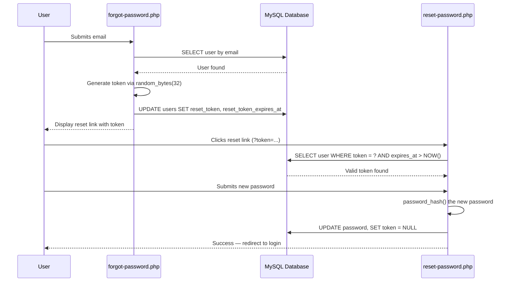

# My Guide — PHP Car Rental System (php_car_rental_anes)

> [!NOTE]
> This guide documents **every file** in the project, explaining its purpose, the tools and technologies it uses, and how it connects to the rest of the system.

---

## Table of Contents

- [Project Overview](#project-overview)
- [Technology Stack](#technology-stack)
- [Project Structure](#project-structure)
- [Configuration & Database](#1-configuration--database)
- [Shared Includes (Templates)](#2-shared-includes-templates)
- [Public-Facing Pages](#3-public-facing-pages)
- [Admin Panel](#4-admin-panel)
- [CSS Styling](#5-css-styling)
- [JavaScript](#6-javascript)
- [SQL Files](#7-sql-files)
- [Utility / Seed Files](#8-utility--seed-files)
- [Images & Assets](#9-images--assets)
- [README](#10-readme)
- [Security & Methods Used](#11-security--methods-used)
- [File Interconnection Diagram](#file-interconnection-diagram)

---

## Project Overview

This is a **full-stack car rental web application** built with PHP, MySQL, HTML, CSS, and JavaScript. It allows users to browse available cars, register/login, make reservations, leave reviews, and manage their bookings. An admin panel provides management capabilities for cars, users, and reservations.

---

## Technology Stack

| Layer | Technology | Purpose |
|---|---|---|
| **Backend** | PHP 7+ | Server-side logic, form handling, session management |
| **Database** | MySQL (via MySQLi) | Data storage for users, cars, bookings, reviews |
| **Frontend** | HTML5, CSS3 | Page structure and styling |
| **JavaScript** | Vanilla JS (ES6+) | Client-side interactivity, form validation, animations |
| **Server** | XAMPP (Apache + MySQL) | Local development environment |
| **Icons** | Font Awesome 6.0 (CDN) | UI icons throughout the application |
| **Fonts** | Google Fonts — Inter | Modern typography |
| **Security** | `password_hash()` / `password_verify()` (bcrypt), prepared statements, `htmlspecialchars()` | Password hashing, SQL injection prevention, XSS prevention |

---

## Project Structure

```
php_car_rental_anes/
├── config/
│   └── db.php                    # Database connection
├── includes/
│   ├── header.php                # Shared HTML header & navigation
│   └── footer.php                # Shared HTML footer
├── admin/
│   ├── includes/
│   │   ├── admin_header.php      # Admin panel header & sidebar
│   │   └── admin_footer.php      # Admin panel footer
│   ├── index.php                 # Admin dashboard
│   ├── cars.php                  # Admin car management (CRUD)
│   ├── reservations.php          # Admin reservation management
│   └── users.php                 # Admin user management
├── css/
│   └── style.css                 # Global stylesheet
├── js/
│   └── main.js                   # Client-side JavaScript
├── sql/
│   └── schema.sql                # Database schema (DDL)
├── images/
│   ├── hero.png                  # Homepage hero banner
│   ├── audi_q7.png               # Car image
│   ├── honda_accord.png          # Car image
│   └── cars/                     # Additional car images
│       ├── economy.png
│       ├── mercedes_s_class.png
│       ├── porsche_911.png
│       ├── renault_clio.png
│       ├── sedan.png
│       ├── suv.png
│       ├── toyota_hilux.png
│       ├── toyota_land_cruiser.png
│       └── volkswagen_touareg.png
├── index.php                     # Homepage
├── login.php                     # User login
├── register.php                  # User registration
├── logout.php                    # Session destruction
├── forgot-password.php           # Password recovery request
├── reset-password.php            # Password reset with token
├── car-details.php               # Individual car details page
├── booking.php                   # Booking creation page
├── my-bookings.php               # User's booking history
├── reviews.php                   # Car reviews page
├── contact.php                   # Contact page
├── database.sql                  # Legacy database schema
├── seed.php                      # Database seeder script
├── test_db.php                   # Database connection test
└── README.md                     # Project documentation
```

---

## 1. Configuration & Database

---

### [db.php](file:///c:/xampp/htdocs/php_car_rental_anes/config/db.php)

**Purpose:** Establishes the database connection used by every PHP file in the project.

**Function:**
- Defines four constants: `DB_HOST` (`localhost`), `DB_USER` (`root`), `DB_PASS` (empty), `DB_NAME` (`car_rental`)
- Creates a `mysqli` connection object (`$conn`)
- Checks for connection errors and terminates with an error message if the connection fails
- Sets the character encoding to `utf8` using `$conn->set_charset('utf8')`

**Tools & Technologies:**
| Tool | Usage |
|---|---|
| `mysqli` (PHP extension) | Procedural/OOP MySQL interface for database operations |
| `define()` | PHP constant definition for database credentials |
| `$conn->set_charset('utf8')` | Ensures proper UTF-8 encoding for multilingual support |

**Connections:** This file is included (`require_once`) by virtually every PHP file in the project that needs database access — all public pages, admin pages, and utility scripts.

**Notable Pattern:** Uses **OOP-style MySQLi** (`new mysqli(...)`) rather than procedural style.

---

## 2. Shared Includes (Templates)

---

### [header.php](file:///c:/xampp/htdocs/php_car_rental_anes/includes/header.php)

**Purpose:** Provides the shared HTML `<head>` section and navigation bar for all public-facing pages.

**Function:**
- Starts a PHP session (`session_start()`) if one isn't already active
- Outputs the HTML5 doctype, `<head>` meta tags, and links to external resources
- Renders a responsive navigation bar with:
  - Logo linking to the homepage
  - Navigation links: Home, Contact, Reviews
  - Conditional links based on login status:
    - **Logged in:** My Bookings, Logout, and the user's name
    - **Logged out:** Login, Register
  - Admin link (visible only to admin users — checks `$_SESSION['role'] === 'admin'`)
  - A mobile hamburger menu toggle button

**Tools & Technologies:**
| Tool | Usage |
|---|---|
| `session_start()` | PHP session management for authentication state |
| `$_SESSION` | Superglobal for checking login status and user role |
| Font Awesome 6.0 (CDN) | Icon library for navigation icons (`fa-car`, `fa-user`, etc.) |
| Google Fonts — Inter | Modern sans-serif font loaded via CDN |
| `htmlspecialchars()` | XSS prevention when outputting the user's name |

**Connections:** Included by all public pages: [index.php](file:///c:/xampp/htdocs/php_car_rental_anes/index.php), [login.php](file:///c:/xampp/htdocs/php_car_rental_anes/login.php), [register.php](file:///c:/xampp/htdocs/php_car_rental_anes/register.php), [car-details.php](file:///c:/xampp/htdocs/php_car_rental_anes/car-details.php), [booking.php](file:///c:/xampp/htdocs/php_car_rental_anes/booking.php), [my-bookings.php](file:///c:/xampp/htdocs/php_car_rental_anes/my-bookings.php), [contact.php](file:///c:/xampp/htdocs/php_car_rental_anes/contact.php), [reviews.php](file:///c:/xampp/htdocs/php_car_rental_anes/reviews.php), [forgot-password.php](file:///c:/xampp/htdocs/php_car_rental_anes/forgot-password.php), [reset-password.php](file:///c:/xampp/htdocs/php_car_rental_anes/reset-password.php).

---

### [footer.php](file:///c:/xampp/htdocs/php_car_rental_anes/includes/footer.php)

**Purpose:** Provides the shared HTML footer and loads JavaScript for all public-facing pages.

**Function:**
- Renders a `<footer>` element with:
  - Company name and copyright notice with dynamic year (`date('Y')`)
  - Three columns of links: Quick Links, Services, Contact Info
  - Social media icon links (Facebook, Twitter, Instagram, LinkedIn)
- Includes the [main.js](file:///c:/xampp/htdocs/php_car_rental_anes/js/main.js) script
- Closes `</body>` and `</html>` tags

**Tools & Technologies:**
| Tool | Usage |
|---|---|
| `date('Y')` | PHP function for dynamic copyright year |
| Font Awesome icons | Social media icons (`fa-facebook-f`, `fa-twitter`, etc.) |
| `<script src>` | Loads the main JavaScript file |

**Connections:** Included by all public pages (same list as header.php).

---

## 3. Public-Facing Pages

---

### [index.php](file:///c:/xampp/htdocs/php_car_rental_anes/index.php) — Homepage

**Purpose:** The landing page of the application. Showcases the car rental service and displays featured/available cars.

**Function:**
1. Includes `config/db.php` and `includes/header.php`
2. Renders a **hero section** with a headline, tagline, and "Browse Cars" CTA button
3. Builds and executes a **dynamic SQL query** to fetch cars from the database:
   - Supports **filtering** by car type (GET parameter `type`)
   - Supports **searching** by brand or model (GET parameter `search`)
   - Uses **prepared statements** with parameter binding for security
4. Displays a **filter bar** with car type buttons (All, Economy, Sedan, SUV, Luxury, Pickup)
5. Displays a **search bar** for text-based car search
6. Renders a **car grid** showing each car as a card with:
   - Car image (with fallback placeholder)
   - Brand, model, year, type, transmission, fuel type
   - Price per day
   - "View Details" link to [car-details.php](file:///c:/xampp/htdocs/php_car_rental_anes/car-details.php)
7. Shows "no cars found" message if the query returns zero results
8. Includes `includes/footer.php`

**Tools & Technologies:**
| Tool | Usage |
|---|---|
| MySQLi prepared statements | `$conn->prepare()`, `bind_param()`, `execute()` for safe SQL |
| `$_GET` | Reading `type` and `search` query parameters |
| `htmlspecialchars()` | XSS prevention on all output values |
| `number_format()` | Formatting price display with 2 decimal places |
| Dynamic SQL construction | Appending `WHERE` clauses conditionally |

**Notable Pattern:** The SQL query is built dynamically by appending conditions to arrays (`$conditions`, `$params`, `$types`), then joining them — a clean pattern for optional filters.

---

### [login.php](file:///c:/xampp/htdocs/php_car_rental_anes/login.php) — User Login

**Purpose:** Authenticates users and starts their session.

**Function:**
1. Starts session, includes database config and header
2. Redirects already-logged-in users to the homepage
3. On POST request:
   - Retrieves and trims `email` and `password` from the form
   - Validates that fields are not empty
   - Queries the `users` table for a matching email using a **prepared statement**
   - Verifies the password using `password_verify()` (bcrypt comparison)
   - On success: sets session variables (`user_id`, `name`, `email`, `role`) and redirects to homepage
   - On failure: displays an "Invalid email or password" error
4. Renders a login form with email and password fields
5. Provides links to [register.php](file:///c:/xampp/htdocs/php_car_rental_anes/register.php) and [forgot-password.php](file:///c:/xampp/htdocs/php_car_rental_anes/forgot-password.php)

**Tools & Technologies:**
| Tool | Usage |
|---|---|
| `password_verify()` | Bcrypt password comparison |
| `$_SESSION` | Storing authenticated user data |
| `header('Location: ...')` | HTTP redirect after successful login |
| MySQLi prepared statements | Preventing SQL injection |
| `trim()` | Input sanitization |
| `htmlspecialchars()` | XSS prevention in form re-population |

---

### [register.php](file:///c:/xampp/htdocs/php_car_rental_anes/register.php) — User Registration

**Purpose:** Allows new users to create an account.

**Function:**
1. Starts session, includes database config and header
2. Redirects already-logged-in users to the homepage
3. On POST request:
   - Retrieves and trims `name`, `email`, `phone`, `password`, `confirm_password`
   - **Validation chain:**
     - All fields required
     - Valid email format (`filter_var()` with `FILTER_VALIDATE_EMAIL`)
     - Phone must be at least 8 characters
     - Password must be at least 6 characters
     - Passwords must match
     - Email must not already exist in the database (uniqueness check via prepared statement)
   - On valid input: hashes password with `password_hash()` (bcrypt), inserts user with `role = 'user'`
   - Sets session variables and redirects to homepage
4. Renders a registration form with all fields
5. Provides a link to [login.php](file:///c:/xampp/htdocs/php_car_rental_anes/login.php)

**Tools & Technologies:**
| Tool | Usage |
|---|---|
| `password_hash($password, PASSWORD_DEFAULT)` | Bcrypt hashing for secure password storage |
| `filter_var()` with `FILTER_VALIDATE_EMAIL` | Server-side email validation |
| `strlen()` | Length validation for phone and password |
| MySQLi prepared statements | INSERT and SELECT with parameter binding |
| `$conn->insert_id` | Retrieves the auto-incremented ID of the new user |

---

### [logout.php](file:///c:/xampp/htdocs/php_car_rental_anes/logout.php) — Session Destruction

**Purpose:** Logs the user out by destroying their session.

**Function:**
1. Starts the session (to access it)
2. Calls `session_unset()` to clear all session variables
3. Calls `session_destroy()` to destroy the session on the server
4. Redirects the user to [login.php](file:///c:/xampp/htdocs/php_car_rental_anes/login.php)

**Tools & Technologies:**
| Tool | Usage |
|---|---|
| `session_start()` | Resumes the session to be destroyed |
| `session_unset()` | Clears all `$_SESSION` variables |
| `session_destroy()` | Destroys the session data on the server |
| `header('Location: login.php')` | Redirect to login page |

**Notable Pattern:** This is a minimal, single-purpose file — no HTML output, just session cleanup and redirect.

---

### [forgot-password.php](file:///c:/xampp/htdocs/php_car_rental_anes/forgot-password.php) — Password Recovery Request

**Purpose:** Allows users to request a password reset link by entering their email.

**Function:**
1. Includes database config and header
2. On POST request:
   - Validates the email exists in the `users` table
   - Generates a **cryptographically secure random token** using `bin2hex(random_bytes(32))`
   - Calculates a token expiry time (1 hour from now) using `date('Y-m-d H:i:s', strtotime('+1 hour'))`
   - Stores the token and expiry in the `users` table via UPDATE query
   - Constructs a reset URL: `reset-password.php?token=<token>`
   - Displays the reset link directly on the page (simulates email delivery for development)
3. Renders a form with an email input field

**Tools & Technologies:**
| Tool | Usage |
|---|---|
| `random_bytes(32)` | Cryptographically secure random byte generation |
| `bin2hex()` | Converts binary token to hexadecimal string (64 chars) |
| `strtotime('+1 hour')` | Calculates expiry timestamp |
| `date('Y-m-d H:i:s')` | Formats datetime for MySQL storage |
| MySQLi prepared statements | SELECT and UPDATE queries |

> [!IMPORTANT]
> In production, the reset link should be sent via email (e.g., using PHPMailer or `mail()`). Currently, the link is displayed on-screen for development convenience.

---

### [reset-password.php](file:///c:/xampp/htdocs/php_car_rental_anes/reset-password.php) — Password Reset

**Purpose:** Allows users to set a new password using a valid reset token.

**Function:**
1. Reads the `token` from `$_GET`
2. Validates the token exists in the database AND has not expired (`reset_expiry > NOW()`)
3. On POST request:
   - Validates new password (minimum 6 characters)
   - Validates passwords match
   - Hashes the new password with `password_hash()`
   - Updates the user's password and clears the token/expiry fields (sets them to `NULL`)
   - Displays a success message with a link to login
4. If the token is invalid or expired, shows an error message

**Tools & Technologies:**
| Tool | Usage |
|---|---|
| `password_hash()` | Bcrypt hashing for the new password |
| `NOW()` MySQL function | Server-side time comparison for token expiry |
| MySQLi prepared statements | Token validation and password update |
| `$_GET['token']` | Reading the token from the URL |

---

### [car-details.php](file:///c:/xampp/htdocs/php_car_rental_anes/car-details.php) — Car Details Page

**Purpose:** Displays full details of a specific car and its reviews. Allows logged-in users to submit reviews.

**Function:**
1. Reads `car_id` from `$_GET` and validates it as an integer
2. Fetches the car's details from the `cars` table
3. Shows a 404-style message if the car is not found
4. Displays:
   - Large car image with availability badge
   - Full specifications: brand, model, year, type, transmission, fuel type, seats, price
   - "Book Now" button (links to [booking.php](file:///c:/xampp/htdocs/php_car_rental_anes/booking.php))
5. **Reviews section:**
   - Fetches all reviews for this car from the `reviews` table (JOIN with `users`)
   - Displays each review with star rating, reviewer name, date, and comment
   - Calculates and displays average rating
6. **Review submission form** (visible only to logged-in users):
   - On POST: inserts a new review with `user_id`, `car_id`, `rating`, `comment`
   - Redirects back to the same page to show the new review

**Tools & Technologies:**
| Tool | Usage |
|---|---|
| `intval()` | Casting car_id to integer for safety |
| `JOIN` SQL query | Joining `reviews` with `users` to get reviewer names |
| `AVG()` SQL aggregate | Calculating average rating |
| `ORDER BY created_at DESC` | Sorting reviews newest-first |
| `str_repeat()` | Generating star icons (★) for ratings |
| `date('M d, Y')` | Formatting review dates |
| MySQLi prepared statements | All database queries |

---

### [booking.php](file:///c:/xampp/htdocs/php_car_rental_anes/booking.php) — Booking / Reservation Page

**Purpose:** Allows logged-in users to create a car rental reservation.

**Function:**
1. **Authentication check:** Redirects to login if not logged in
2. Reads `car_id` from `$_GET`, validates and fetches the car
3. On POST request:
   - Reads `pickup_date`, `return_date`, `pickup_location` from the form
   - **Validation:**
     - All fields required
     - Pickup date must be today or later
     - Return date must be after pickup date
   - **Price calculation:** Calculates the number of days (`DateTime` diff) and multiplies by daily rate
   - **Availability check:** Queries existing reservations for overlapping date ranges using SQL `NOT (return_date < ? OR pickup_date > ?)` logic
   - If available: inserts a new reservation with status `'pending'` and total price
   - If not available: shows an error about conflicting dates
   - Redirects to [my-bookings.php](file:///c:/xampp/htdocs/php_car_rental_anes/my-bookings.php) on success
4. Renders a booking form showing:
   - Car summary (image, name, price)
   - Date pickers for pickup and return dates
   - Pickup location text field

**Tools & Technologies:**
| Tool | Usage |
|---|---|
| `DateTime` class | Date difference calculation for pricing |
| `$interval->days` | Number of days between pickup and return |
| Date overlap SQL query | Checking for conflicting reservations |
| `date('Y-m-d')` | Today's date for minimum date validation |
| `number_format()` | Formatting calculated total price |
| MySQLi prepared statements | SELECT for availability, INSERT for new booking |

**Notable Pattern:** The availability check uses the **complement** approach — `NOT (end_before_start OR start_after_end)` — which is the standard algorithm for detecting date range overlaps.

---

### [my-bookings.php](file:///c:/xampp/htdocs/php_car_rental_anes/my-bookings.php) — User's Booking History

**Purpose:** Shows all reservations made by the currently logged-in user.

**Function:**
1. **Authentication check:** Redirects to login if not logged in
2. **Cancel booking handler:** If a POST request with `cancel_booking_id` is received:
   - Verifies the reservation belongs to the current user
   - Updates its status to `'cancelled'`
3. Fetches all reservations for the user (JOIN with `cars` table), ordered by creation date descending
4. Displays a table/card list with:
   - Car image, brand, model
   - Pickup and return dates
   - Total price
   - Status badge (color-coded: pending=orange, confirmed=green, cancelled=red, completed=blue)
   - Cancel button (only for `pending` or `confirmed` reservations)
5. Shows "no bookings yet" message with a link to the homepage if empty

**Tools & Technologies:**
| Tool | Usage |
|---|---|
| `JOIN` SQL | Joining `reservations` with `cars` for car details |
| Status-based styling | Dynamic CSS class assignment based on reservation status |
| `date('M d, Y')` | Formatting dates for display |
| `number_format()` | Price formatting |
| `$_POST['cancel_booking_id']` | Cancellation via form POST |
| MySQLi prepared statements | All queries use parameter binding |

---

### [reviews.php](file:///c:/xampp/htdocs/php_car_rental_anes/reviews.php) — All Reviews Page

**Purpose:** Displays all reviews across all cars, serving as a testimonials page.

**Function:**
1. Fetches all reviews from the database using a **triple JOIN** (`reviews` → `users` → `cars`)
2. Orders reviews by `created_at DESC` (newest first)
3. Displays each review as a card with:
   - Reviewer's name
   - Car brand and model
   - Star rating (visual)
   - Comment text
   - Date posted
4. Shows "no reviews yet" message if the table is empty

**Tools & Technologies:**
| Tool | Usage |
|---|---|
| Multi-table JOIN | `reviews JOIN users JOIN cars` for denormalized display |
| `str_repeat('★', $rating)` | Generating filled star icons |
| `str_repeat('☆', 5 - $rating)` | Generating empty star icons |
| `htmlspecialchars()` | XSS prevention on all output |
| `date('M d, Y')` | Date formatting |

---

### [contact.php](file:///c:/xampp/htdocs/php_car_rental_anes/contact.php) — Contact Page

**Purpose:** Provides a contact form and company contact information.

**Function:**
1. On POST request:
   - Reads `name`, `email`, `subject`, `message` from the form
   - Validates all fields are filled
   - Validates email format with `filter_var()`
   - Displays a success message (no actual email sending — development placeholder)
2. Renders the page with:
   - A **contact information section** with phone, email, address, and business hours
   - A **contact form** with name, email, subject, and message fields
   - Font Awesome icons for each contact method

**Tools & Technologies:**
| Tool | Usage |
|---|---|
| `filter_var()` with `FILTER_VALIDATE_EMAIL` | Email validation |
| `trim()` | Input sanitization |
| `htmlspecialchars()` | XSS prevention in re-populated form values |
| Font Awesome icons | Visual indicators for contact methods |

> [!NOTE]
> The contact form currently only validates and displays a success message. In production, it should send an email (via `mail()` or PHPMailer) or store the message in the database.

---

## 4. Admin Panel

---

### [admin/index.php](file:///c:/xampp/htdocs/php_car_rental_anes/admin/index.php) — Admin Dashboard

**Purpose:** The main admin dashboard showing key statistics and recent activity.

**Function:**
1. **Authorization check:** Verifies the user is logged in AND has `role === 'admin'`; redirects to the public homepage otherwise
2. Fetches **dashboard statistics** using aggregate SQL queries:
   - Total number of cars (`SELECT COUNT(*) FROM cars`)
   - Total number of users (`SELECT COUNT(*) FROM users`)
   - Total number of reservations (`SELECT COUNT(*) FROM reservations`)
   - Total revenue from confirmed/completed reservations (`SELECT SUM(total_price) FROM reservations WHERE status IN ('confirmed','completed')`)
3. Fetches the **5 most recent reservations** (JOIN with `users` and `cars`)
4. Displays:
   - Four stat cards (Total Cars, Total Users, Total Reservations, Total Revenue)
   - A "Recent Reservations" table with user name, car, dates, total price, and status

**Tools & Technologies:**
| Tool | Usage |
|---|---|
| `COUNT(*)` SQL aggregate | Counting records for statistics |
| `SUM()` SQL aggregate | Summing revenue |
| `WHERE status IN (...)` | Filtering only revenue-generating reservations |
| `LIMIT 5` | Limiting to most recent reservations |
| Multi-table JOIN | `reservations JOIN users JOIN cars` |
| `number_format()` | Formatting currency values |
| Role-based access control | Session-based admin check |

---

### [admin/cars.php](file:///c:/xampp/htdocs/php_car_rental_anes/admin/cars.php) — Car Management (CRUD)

**Purpose:** Full CRUD (Create, Read, Update, Delete) interface for managing the car inventory.

**Function:**
1. **Authorization check** (same as dashboard)
2. **Handles four operations based on `$_GET['action']`:**
   - **`add` (POST):** Inserts a new car with brand, model, year, type, price, image, seats, transmission, fuel type, availability status
   - **`edit` (POST):** Updates an existing car's details
   - **`delete` (GET):** Deletes a car by ID
   - **Default (no action):** Lists all cars
3. **Add Car Form:** Full form with text inputs, select dropdowns (type, transmission, fuel type, availability), and number inputs
4. **Edit Car Form:** Pre-populated form fetched via car ID
5. **Car List:** Table showing all cars with image thumbnail, brand, model, year, type, price, status badge, and Edit/Delete action buttons

**Tools & Technologies:**
| Tool | Usage |
|---|---|
| `$_GET['action']` | Routing to add/edit/delete views |
| MySQLi prepared statements | All INSERT, UPDATE, DELETE, SELECT queries |
| `intval()` | Integer casting for IDs |
| `htmlspecialchars()` | XSS prevention on all form outputs |
| `number_format()` | Price formatting |
| HTML `<select>` elements | Dropdown selectors for type, transmission, fuel |
| `selected` attribute logic | Pre-selecting current values in edit form |

**Notable Pattern:** Uses a single-file routing pattern — the action is determined by a GET parameter, and the file handles all CRUD operations in one place. This is a common PHP pattern for admin panels.

---

### [admin/reservations.php](file:///c:/xampp/htdocs/php_car_rental_anes/admin/reservations.php) — Reservation Management

**Purpose:** Allows admins to view all reservations and update their statuses.

**Function:**
1. **Authorization check**
2. **Status update handler:** On POST with `reservation_id` and `status`:
   - Updates the reservation's status (pending, confirmed, cancelled, completed)
   - Uses a prepared statement for the UPDATE
3. Fetches all reservations using a multi-table JOIN (reservations + users + cars), ordered by creation date descending
4. Displays a table with:
   - Reservation ID
   - Customer name
   - Car (brand + model)
   - Pickup and return dates
   - Total price
   - Status badge (color-coded)
   - **Status update form:** Inline dropdown with all four status options and an "Update" button

**Tools & Technologies:**
| Tool | Usage |
|---|---|
| Multi-table JOIN | `reservations JOIN users JOIN cars` |
| `$_POST['status']` | New status from the inline form |
| Inline `<form>` | Each row has its own form for status updates |
| `<select>` with `selected` | Pre-selects the current status |
| Status color coding | Visual distinction between reservation states |
| `number_format()` | Price formatting |
| `date('M d, Y')` | Date formatting |

---

### [admin/users.php](file:///c:/xampp/htdocs/php_car_rental_anes/admin/users.php) — User Management

**Purpose:** Allows admins to view all registered users and their booking counts.

**Function:**
1. **Authorization check**
2. Fetches all users with a **LEFT JOIN** and **GROUP BY** to count each user's reservations:
   ```sql
   SELECT users.*, COUNT(reservations.id) as booking_count
   FROM users
   LEFT JOIN reservations ON users.id = reservations.user_id
   GROUP BY users.id
   ORDER BY users.created_at DESC
   ```
3. Displays a table with:
   - User ID
   - Name
   - Email
   - Phone
   - Role (User/Admin)
   - Number of bookings
   - Registration date

**Tools & Technologies:**
| Tool | Usage |
|---|---|
| `LEFT JOIN` | Includes users with zero bookings |
| `COUNT()` with `GROUP BY` | Aggregating booking count per user |
| `$conn->query()` | Direct query (no user input = no injection risk) |
| `date('M d, Y')` | Date formatting |
| `ucfirst()` | Capitalizing role names for display |

---

### [admin/includes/admin_header.php](file:///c:/xampp/htdocs/php_car_rental_anes/admin/includes/admin_header.php) — Admin Header & Sidebar

**Purpose:** Provides the HTML head, sidebar navigation, and top bar for the admin panel.

**Function:**
1. Starts the session
2. Outputs HTML5 head with:
   - Font Awesome 6.0 CDN
   - Google Fonts (Inter)
   - Reference to the shared [style.css](file:///c:/xampp/htdocs/php_car_rental_anes/css/style.css)
3. Renders a **sidebar** with navigation links:
   - Dashboard (`admin/index.php`)
   - Manage Cars (`admin/cars.php`)
   - Reservations (`admin/reservations.php`)
   - Users (`admin/users.php`)
   - Back to Site (public homepage)
   - Logout
4. Highlights the **active page** by comparing `basename($_SERVER['PHP_SELF'])` against each link

**Tools & Technologies:**
| Tool | Usage |
|---|---|
| `basename($_SERVER['PHP_SELF'])` | Determining the current page for active nav highlighting |
| Font Awesome icons | Sidebar navigation icons |
| Ternary operator | Conditional CSS class assignment for active state |
| `$_SESSION['name']` | Displaying admin name in the top bar |

---

### [admin/includes/admin_footer.php](file:///c:/xampp/htdocs/php_car_rental_anes/admin/includes/admin_footer.php) — Admin Footer

**Purpose:** Closes the HTML structure for admin pages.

**Function:**
- Outputs closing `</div>`, `</body>`, and `</html>` tags
- Minimal file (no JavaScript references in the admin panel)

---

## 5. CSS Styling

---

### [style.css](file:///c:/xampp/htdocs/php_car_rental_anes/css/style.css)

**Purpose:** The single, comprehensive stylesheet for the entire application (both public pages and admin panel).

**Function & Organization:**
The file is approximately **600+ lines** organized into these major sections:

| Section | Description |
|---|---|
| **CSS Variables (`:root`)** | Design tokens: primary color (`#e63946`), secondary (`#1d3557`), dark bg, light bg, border radius, box shadow, transition speed |
| **Reset & Base** | Universal box-sizing, body font (Inter), background, line-height |
| **Navigation** | Sticky navbar, flex layout, logo styling, nav links with hover effects, mobile hamburger menu |
| **Hero Section** | Full-viewport hero with background image, overlay gradient, centered text, animated CTA button |
| **Filter & Search** | Car type filter buttons, search bar styling, active state highlighting |
| **Car Grid** | CSS Grid layout (`grid-template-columns: repeat(auto-fill, minmax(300px, 1fr))`), car card styling with hover transform and shadow effects |
| **Car Details** | Two-column layout for car detail page, specification grid, image styling |
| **Forms** | Auth forms (login/register), booking form, contact form — consistent styling with focus states and transitions |
| **Reviews** | Review cards, star rating display, review form styling |
| **Bookings Table** | My-bookings cards/table, status badges with color-coding |
| **Footer** | Multi-column footer layout, social media links, hover effects |
| **Admin Panel** | Sidebar layout (fixed 250px), main content area, dashboard stat cards, admin tables, admin forms |
| **Responsive Design** | Media queries for tablets (`max-width: 768px`) and mobile (`max-width: 480px`) |
| **Animations** | `@keyframes fadeIn` for page load animations |

**Tools & Technologies:**
| Tool | Usage |
|---|---|
| CSS Custom Properties | `var(--primary-color)`, `var(--secondary-color)`, etc. for theming |
| CSS Grid | Car grid layout with `auto-fill` and `minmax()` |
| Flexbox | Navigation, card layouts, form layouts |
| CSS Transitions | `transition: all 0.3s ease` for smooth hover effects |
| `@keyframes` | `fadeIn` animation for page elements |
| Media Queries | Responsive breakpoints at 768px and 480px |
| `position: sticky` | Sticky navigation bar |
| `transform: translateY(-5px)` | Card hover lift effect |
| Gradient overlays | Hero section `linear-gradient` overlay |
| `box-shadow` | Elevation effects on cards and buttons |

**Notable Pattern:** The entire app uses a **design token system** via CSS variables, making theme changes (colors, spacing, shadows) easy to implement globally.

---

## 6. JavaScript

---

### [main.js](file:///c:/xampp/htdocs/php_car_rental_anes/js/main.js)

**Purpose:** Client-side interactivity, form validation, animations, and UX enhancements.

**Function & Features:**

| Feature | Description |
|---|---|
| **Mobile Menu Toggle** | Toggles the `.nav-links` visibility when the hamburger icon is clicked; adds `active` class |
| **Smooth Scrolling** | Intercepts anchor link clicks and uses `element.scrollIntoView({ behavior: 'smooth' })` |
| **Scroll Animations** | Uses `IntersectionObserver` to detect when elements with `.animate-on-scroll` enter the viewport, triggering CSS animations |
| **Form Validation** | Client-side validation for login, register, booking, and contact forms: checks empty fields, email format (regex), password length, password match, date validity |
| **Booking Price Calculator** | Real-time price estimation: listens to date input changes, calculates the number of days, and displays the estimated total price dynamically |
| **Star Rating Interaction** | Makes the review rating stars interactive — hovering highlights stars, clicking sets the hidden input value |
| **Flash Messages** | Auto-fades success/error alert messages after 5 seconds using `setTimeout` and opacity transition |
| **Navbar Scroll Effect** | Adds a `scrolled` class to the navbar on scroll (`window.scrollY > 50`), triggering a visual change (shadow/background) |

**Tools & Technologies:**
| Tool | Usage |
|---|---|
| `document.addEventListener('DOMContentLoaded')` | Ensures DOM is ready before attaching handlers |
| `IntersectionObserver` API | Efficient scroll-based animations (no scroll event listeners) |
| `querySelector` / `querySelectorAll` | DOM element selection |
| `addEventListener` | Event handling for clicks, submits, scrolls, input changes |
| `element.scrollIntoView()` | Native smooth scrolling API |
| `setTimeout` | Delayed flash message removal |
| `new Date()` | Date calculation for booking price |
| Regular Expression | Email validation: `/^[^\s@]+@[^\s@]+\.[^\s@]+$/` |
| `element.classList.add/remove/toggle` | CSS class manipulation for animations and states |
| `event.preventDefault()` | Preventing default form submission for validation |

**Notable Pattern:** Uses the **IntersectionObserver API** for scroll animations — this is a modern, performant alternative to listening to scroll events and checking element positions manually.

---

## 7. SQL Files

---

### [schema.sql](file:///c:/xampp/htdocs/php_car_rental_anes/sql/schema.sql)

**Purpose:** The primary database schema definition file. Creates the database and all tables.

**Function:**
1. Creates the `car_rental` database if it doesn't exist
2. Selects the database with `USE car_rental`
3. Creates **four tables** with `CREATE TABLE IF NOT EXISTS`:

#### Table: `users`
| Column | Type | Details |
|---|---|---|
| `id` | INT AUTO_INCREMENT | Primary key |
| `name` | VARCHAR(100) | NOT NULL |
| `email` | VARCHAR(100) | NOT NULL, UNIQUE |
| `phone` | VARCHAR(20) | Nullable |
| `password` | VARCHAR(255) | NOT NULL (stores bcrypt hash) |
| `role` | ENUM('user','admin') | DEFAULT 'user' |
| `reset_token` | VARCHAR(64) | Nullable (for password reset) |
| `reset_expiry` | DATETIME | Nullable (token expiry) |
| `created_at` | TIMESTAMP | DEFAULT CURRENT_TIMESTAMP |

#### Table: `cars`
| Column | Type | Details |
|---|---|---|
| `id` | INT AUTO_INCREMENT | Primary key |
| `brand` | VARCHAR(50) | NOT NULL |
| `model` | VARCHAR(50) | NOT NULL |
| `year` | INT | NOT NULL |
| `type` | ENUM('economy','sedan','suv','luxury','pickup') | NOT NULL |
| `price_per_day` | DECIMAL(10,2) | NOT NULL |
| `image` | VARCHAR(255) | Nullable |
| `seats` | INT | DEFAULT 5 |
| `transmission` | ENUM('automatic','manual') | DEFAULT 'automatic' |
| `fuel_type` | ENUM('petrol','diesel','electric','hybrid') | DEFAULT 'petrol' |
| `available` | BOOLEAN | DEFAULT TRUE |
| `created_at` | TIMESTAMP | DEFAULT CURRENT_TIMESTAMP |

#### Table: `reservations`
| Column | Type | Details |
|---|---|---|
| `id` | INT AUTO_INCREMENT | Primary key |
| `user_id` | INT | FK → `users(id)` with CASCADE delete |
| `car_id` | INT | FK → `cars(id)` with CASCADE delete |
| `pickup_date` | DATE | NOT NULL |
| `return_date` | DATE | NOT NULL |
| `pickup_location` | VARCHAR(255) | Nullable |
| `total_price` | DECIMAL(10,2) | NOT NULL |
| `status` | ENUM('pending','confirmed','cancelled','completed') | DEFAULT 'pending' |
| `created_at` | TIMESTAMP | DEFAULT CURRENT_TIMESTAMP |

#### Table: `reviews`
| Column | Type | Details |
|---|---|---|
| `id` | INT AUTO_INCREMENT | Primary key |
| `user_id` | INT | FK → `users(id)` with CASCADE delete |
| `car_id` | INT | FK → `cars(id)` with CASCADE delete |
| `rating` | INT | NOT NULL (1–5) |
| `comment` | TEXT | Nullable |
| `created_at` | TIMESTAMP | DEFAULT CURRENT_TIMESTAMP |

**Tools & Technologies:**
| Tool | Usage |
|---|---|
| MySQL DDL | `CREATE DATABASE`, `CREATE TABLE`, `ALTER TABLE` |
| `ENUM` type | Constraining values for status, type, role fields |
| `FOREIGN KEY` constraints | Referential integrity between tables |
| `ON DELETE CASCADE` | Automatic cleanup when parent records are deleted |
| `AUTO_INCREMENT` | Automatic ID generation |
| `DECIMAL(10,2)` | Precise monetary value storage |
| `BOOLEAN` | Car availability flag |

---

### [database.sql](file:///c:/xampp/htdocs/php_car_rental_anes/database.sql)

**Purpose:** A legacy/alternative database schema file. Contains similar DDL to `schema.sql` but may represent an earlier version.

**Function:**
- Creates the same four tables (`users`, `cars`, `reservations`, `reviews`)
- Includes an `INSERT` statement to create a default admin user:
  ```sql
  INSERT INTO users (name, email, password, role)
  VALUES ('Admin', 'admin@carrental.com', '<bcrypt_hash>', 'admin')
  ```

**Tools & Technologies:** Same as `schema.sql`.

> [!NOTE]
> This file appears to be an earlier or alternative version of the schema. The canonical schema is [sql/schema.sql](file:///c:/xampp/htdocs/php_car_rental_anes/sql/schema.sql).

---

## 8. Utility / Seed Files

---

### [seed.php](file:///c:/xampp/htdocs/php_car_rental_anes/seed.php)

**Purpose:** Populates the database with sample data for development and testing.

**Function:**
1. Includes the database config
2. **Creates an admin user** (if not already existing):
   - Email: `admin@carrental.com`
   - Password: `admin123` (hashed with `password_hash()`)
   - Role: `admin`
3. **Inserts sample cars** (approximately 9 cars) with realistic data:
   - Renault Clio (Economy), Toyota Corolla (Sedan), Honda Accord (Sedan)
   - Volkswagen Touareg (SUV), Toyota Land Cruiser (SUV), Audi Q7 (SUV)
   - Mercedes S-Class (Luxury), Porsche 911 (Luxury), Toyota Hilux (Pickup)
4. Uses **prepared statements** for all insertions
5. Outputs success/error messages for each operation

**Tools & Technologies:**
| Tool | Usage |
|---|---|
| `password_hash()` | Hashing the admin password |
| MySQLi prepared statements | Parameterized INSERT queries |
| `$conn->prepare()` / `bind_param()` | Safe data insertion |
| Hardcoded sample data | Realistic car data for testing |

---

### [test_db.php](file:///c:/xampp/htdocs/php_car_rental_anes/test_db.php)

**Purpose:** A simple diagnostic script to verify the database connection is working.

**Function:**
1. Includes `config/db.php`
2. Runs a test query (`SELECT 1` or similar)
3. Outputs "Connection successful" or error details
4. Useful for debugging XAMPP/MySQL setup issues

**Tools & Technologies:**
| Tool | Usage |
|---|---|
| `require_once` | Including the database config |
| `$conn->query()` | Testing a simple query |
| `echo` | Outputting connection status |

---

## 9. Images & Assets

---

### Image Directory Structure

| File | Location | Purpose |
|---|---|---|
| `hero.png` | `images/` | Hero banner background on the homepage |
| `audi_q7.png` | `images/` | Audi Q7 car image |
| `honda_accord.png` | `images/` | Honda Accord car image |
| `economy.png` | `images/cars/` | Economy car category image |
| `sedan.png` | `images/cars/` | Sedan car category image |
| `suv.png` | `images/cars/` | SUV car category image |
| `mercedes_s_class.png` | `images/cars/` | Mercedes S-Class car image |
| `porsche_911.png` | `images/cars/` | Porsche 911 car image |
| `renault_clio.png` | `images/cars/` | Renault Clio car image |
| `toyota_hilux.png` | `images/cars/` | Toyota Hilux car image |
| `toyota_land_cruiser.png` | `images/cars/` | Toyota Land Cruiser car image |
| `volkswagen_touareg.png` | `images/cars/` | Volkswagen Touareg car image |

All images are PNG format and referenced in the `cars.image` database column or directly in HTML `` tags.

---

## 10. README

---

### [README.md](file:///c:/xampp/htdocs/php_car_rental_anes/README.md)

**Purpose:** Project documentation for developers and reviewers.

**Contents:**
- Project name and description
- Technology stack summary
- Installation instructions (XAMPP setup, database import, running the server)
- Feature list
- Default admin credentials
- File structure overview

---

## 11. Security & Methods Used

This section covers every security technique and method used across the project, organized by security domain.

---

### 11.1 Password Hashing (Bcrypt)

**Method:** `password_hash()` with `PASSWORD_DEFAULT` (bcrypt algorithm)

**How it works:** Passwords are **never stored in plain text**. Before storing a password in the database, it is hashed using the bcrypt algorithm, which produces a one-way irreversible hash. Bcrypt automatically generates a unique random **salt** for each password, preventing rainbow table attacks. The `PASSWORD_DEFAULT` constant ensures PHP uses the strongest algorithm available (currently bcrypt, but future-proof).

**Where it is used:**

| File | Usage | Line of Defense |
|---|---|---|
| [register.php](file:///c:/xampp/htdocs/php_car_rental_anes/register.php) | `password_hash($password, PASSWORD_DEFAULT)` — hashes the password before INSERT into `users` table | Protects passwords at registration |
| [reset-password.php](file:///c:/xampp/htdocs/php_car_rental_anes/reset-password.php) | `password_hash($password, PASSWORD_DEFAULT)` — hashes the new password during reset | Protects passwords at reset |
| [seed.php](file:///c:/xampp/htdocs/php_car_rental_anes/seed.php) | `password_hash('admin123', PASSWORD_DEFAULT)` — hashes the default admin password | Protects seed/demo passwords |
| [database.sql](file:///c:/xampp/htdocs/php_car_rental_anes/database.sql) | Pre-computed bcrypt hash stored in the INSERT statement for the default admin user | Database-level seeded credential |

**Complementary method:** `password_verify()` is used in [login.php](file:///c:/xampp/htdocs/php_car_rental_anes/login.php) to compare the submitted password against the stored hash:
```php
if ($user && password_verify($password, $user['password_hash'])) {
    // Authentication successful
}
```
This approach means even if the database is compromised, the actual passwords **cannot be recovered**.

---

### 11.2 SQL Injection Prevention (Prepared Statements)

**Method:** PDO Prepared Statements with parameterized queries

**How it works:** Instead of concatenating user input directly into SQL strings (which allows attackers to inject malicious SQL), the project uses **parameterized queries**. The SQL structure is sent to MySQL first (with `?` placeholders), and user values are bound separately via `execute()`. This makes SQL injection **impossible** because user input is never interpreted as SQL code.

**Where it is used:**

| File | Query Type | Example |
|---|---|---|
| [login.php](file:///c:/xampp/htdocs/php_car_rental_anes/login.php) | SELECT | `"SELECT * FROM users WHERE email = ? LIMIT 1"` |
| [register.php](file:///c:/xampp/htdocs/php_car_rental_anes/register.php) | SELECT + INSERT | Email uniqueness check + user insertion |
| [index.php](file:///c:/xampp/htdocs/php_car_rental_anes/index.php) | SELECT | Dynamic WHERE clause with bound parameters for filtering |
| [car-details.php](file:///c:/xampp/htdocs/php_car_rental_anes/car-details.php) | SELECT + INSERT | Car fetch, review fetch, duplicate review check, review insertion |
| [booking.php](file:///c:/xampp/htdocs/php_car_rental_anes/booking.php) | SELECT + INSERT | Car fetch, date overlap check, reservation insertion |
| [my-bookings.php](file:///c:/xampp/htdocs/php_car_rental_anes/my-bookings.php) | SELECT | User's reservations with JOIN |
| [forgot-password.php](file:///c:/xampp/htdocs/php_car_rental_anes/forgot-password.php) | SELECT + UPDATE | Email lookup + token storage |
| [reset-password.php](file:///c:/xampp/htdocs/php_car_rental_anes/reset-password.php) | SELECT + UPDATE | Token validation + password update |
| [contact.php](file:///c:/xampp/htdocs/php_car_rental_anes/contact.php) | INSERT | Contact message insertion |
| [seed.php](file:///c:/xampp/htdocs/php_car_rental_anes/seed.php) | INSERT | Sample car data insertion |
| [admin/cars.php](file:///c:/xampp/htdocs/php_car_rental_anes/admin/cars.php) | INSERT + UPDATE + DELETE | Full CRUD operations |
| [admin/reservations.php](file:///c:/xampp/htdocs/php_car_rental_anes/admin/reservations.php) | UPDATE + SELECT | Status updates + car status sync |
| [admin/users.php](file:///c:/xampp/htdocs/php_car_rental_anes/admin/users.php) | UPDATE + DELETE | Role changes + user deletion |

**Additional PDO security setting in** [db.php](file:///c:/xampp/htdocs/php_car_rental_anes/config/db.php):
```php
PDO::ATTR_EMULATE_PREPARES => false
```
This disables emulated prepared statements, forcing MySQL to use **real server-side prepared statements** — the most secure mode.

---

### 11.3 Cross-Site Scripting (XSS) Prevention

**Method:** `htmlspecialchars()` on all dynamic output

**How it works:** Any value that originates from user input or the database is escaped using `htmlspecialchars()` before being rendered in HTML. This converts dangerous characters (`<`, `>`, `"`, `'`, `&`) into their HTML entity equivalents, preventing attackers from injecting `<script>` tags or other malicious HTML.

**Where it is used (40+ instances across the project):**

| File | What is Escaped |
|---|---|
| [includes/header.php](file:///c:/xampp/htdocs/php_car_rental_anes/includes/header.php) | Page title, user's display name |
| [index.php](file:///c:/xampp/htdocs/php_car_rental_anes/index.php) | Car make, model, year, category, transmission, fuel type, seats, image URL, search input re-population |
| [car-details.php](file:///c:/xampp/htdocs/php_car_rental_anes/car-details.php) | Car specifications, reviewer names, review text (`nl2br(htmlspecialchars())` combo), error/success messages |
| [login.php](file:///c:/xampp/htdocs/php_car_rental_anes/login.php) | Email re-population in form, error messages |
| [register.php](file:///c:/xampp/htdocs/php_car_rental_anes/register.php) | Name, email, phone re-population in form, error messages |
| [my-bookings.php](file:///c:/xampp/htdocs/php_car_rental_anes/my-bookings.php) | User name, car names, image URLs, booking status |
| [reviews.php](file:///c:/xampp/htdocs/php_car_rental_anes/reviews.php) | Reviewer names, review text, car names, image URLs |
| [contact.php](file:///c:/xampp/htdocs/php_car_rental_anes/contact.php) | Error/success messages, session-populated name field |
| [forgot-password.php](file:///c:/xampp/htdocs/php_car_rental_anes/forgot-password.php) | Error/success messages, reset link URL |
| [reset-password.php](file:///c:/xampp/htdocs/php_car_rental_anes/reset-password.php) | Token in form action URL, error/success messages |
| [admin/cars.php](file:///c:/xampp/htdocs/php_car_rental_anes/admin/cars.php) | All car data in table and form fields |
| [test_db.php](file:///c:/xampp/htdocs/php_car_rental_anes/test_db.php) | Database error messages |

**Pattern used for review text:**
```php
nl2br(htmlspecialchars($rev['review_text']))
```
This first escapes HTML, then converts newlines to `<br>` tags — safe because `htmlspecialchars()` runs first.

---

### 11.4 Session Management & Security

**Method:** PHP native session handling with secure practices

**How it works:** PHP sessions store a unique session ID in a cookie on the user's browser. Server-side, the session data (user ID, name, role) is stored in temporary files. The project implements several session security best practices.

**Session lifecycle across files:**

| File | Session Operation | Purpose |
|---|---|---|
| [includes/header.php](file:///c:/xampp/htdocs/php_car_rental_anes/includes/header.php) | `session_start()` with `PHP_SESSION_NONE` guard | Safe session start — prevents "session already started" errors |
| [admin/includes/admin_header.php](file:///c:/xampp/htdocs/php_car_rental_anes/admin/includes/admin_header.php) | `session_start()` | Session start for admin pages |
| [login.php](file:///c:/xampp/htdocs/php_car_rental_anes/login.php) | `session_regenerate_id(true)` | **Session fixation prevention** — generates a new session ID after successful login, invalidating the old one |
| [login.php](file:///c:/xampp/htdocs/php_car_rental_anes/login.php) | `$_SESSION['user_id']`, `$_SESSION['user_name']`, `$_SESSION['user_role']` | Stores authenticated user identity |
| [logout.php](file:///c:/xampp/htdocs/php_car_rental_anes/logout.php) | Three-step teardown | Complete session destruction (see below) |

**Secure logout process** in [logout.php](file:///c:/xampp/htdocs/php_car_rental_anes/logout.php):
```php
// Step 1: Clear all session variables
$_SESSION = [];

// Step 2: Destroy the session cookie
if (ini_get('session.use_cookies')) {
    $params = session_get_cookie_params();
    setcookie(session_name(), '', time() - 42000,
        $params['path'], $params['domain'],
        $params['secure'], $params['httponly']);
}

// Step 3: Destroy the server-side session
session_destroy();
```
This three-step approach ensures: (1) server variables are wiped, (2) the session cookie is expired in the browser, and (3) the server-side session file is deleted. This prevents session reuse after logout.

> [!TIP]
> `session_regenerate_id(true)` in `login.php` is a critical defense against **session fixation attacks**, where an attacker sets a known session ID before the victim logs in.

---

### 11.5 Authentication & Access Control (Authorization)

**Method:** Session-based role checking with HTTP redirects

**How it works:** Protected pages check for the presence and value of session variables before allowing access. Unauthorized users are redirected to the login page or homepage.

**Access control layers:**

#### Layer 1 — Authentication Guard (Login Required)
| File | Guard Code | Behavior |
|---|---|---|
| [booking.php](file:///c:/xampp/htdocs/php_car_rental_anes/booking.php) | `if (!isset($_SESSION['user_id']))` | Redirects to `login.php` with redirect-back preservation |
| [my-bookings.php](file:///c:/xampp/htdocs/php_car_rental_anes/my-bookings.php) | `if (!isset($_SESSION['user_id']))` | Redirects to `login.php` |
| [car-details.php](file:///c:/xampp/htdocs/php_car_rental_anes/car-details.php) | Review form only shown if `isset($_SESSION['user_id'])` | Hides review form from guests |

#### Layer 2 — Role-Based Authorization (Admin Required)
| File | Guard Code | Behavior |
|---|---|---|
| [admin/includes/admin_header.php](file:///c:/xampp/htdocs/php_car_rental_anes/admin/includes/admin_header.php) | `if (!isset($_SESSION['user_role']) \|\| $_SESSION['user_role'] !== 'admin')` | Redirects non-admins to the public homepage |
| All admin pages | Inherited from `admin_header.php` via `require_once` | Every admin page is automatically protected |
| [includes/header.php](file:///c:/xampp/htdocs/php_car_rental_anes/includes/header.php) | Admin nav link only shown if `$_SESSION['role'] === 'admin'` | Hides admin link from regular users |

#### Layer 3 — Ownership Verification
| File | Guard Code | Behavior |
|---|---|---|
| [admin/users.php](file:///c:/xampp/htdocs/php_car_rental_anes/admin/users.php) | `if ($id === $_SESSION['user_id'])` | **Self-deletion prevention** — admin cannot delete their own account |
| [admin/users.php](file:///c:/xampp/htdocs/php_car_rental_anes/admin/users.php) | Delete button `disabled` attribute | Also disables the delete button in the UI for the current admin |
| [car-details.php](file:///c:/xampp/htdocs/php_car_rental_anes/car-details.php) | Checks for existing review by same user | **Duplicate review prevention** — user can only review a car once |
| [car-details.php](file:///c:/xampp/htdocs/php_car_rental_anes/car-details.php) | Checks for completed reservation | **Review access control** — user must have a completed rental to review |

#### Layer 4 — Login Role Verification
| File | Guard Code | Behavior |
|---|---|---|
| [login.php](file:///c:/xampp/htdocs/php_car_rental_anes/login.php) | Role-type radio button must match DB role | Prevents customers from accessing admin login and vice versa |
| [login.php](file:///c:/xampp/htdocs/php_car_rental_anes/login.php) | Already-logged-in redirect based on role | Admin → `admin/index.php`, Customer → `index.php` |

---

### 11.6 Input Validation & Sanitization

**Method:** Multi-layer validation (server-side PHP + client-side JavaScript)

**Server-side validation (primary defense):**

| Validation | Method | Files Used In |
|---|---|---|
| **Empty field check** | `empty($field)` | All form-handling files |
| **Email format** | `filter_var($email, FILTER_VALIDATE_EMAIL)` | [login.php](file:///c:/xampp/htdocs/php_car_rental_anes/login.php), [register.php](file:///c:/xampp/htdocs/php_car_rental_anes/register.php), [contact.php](file:///c:/xampp/htdocs/php_car_rental_anes/contact.php), [forgot-password.php](file:///c:/xampp/htdocs/php_car_rental_anes/forgot-password.php) |
| **Password length** | `strlen($password) < 6` | [register.php](file:///c:/xampp/htdocs/php_car_rental_anes/register.php), [reset-password.php](file:///c:/xampp/htdocs/php_car_rental_anes/reset-password.php) |
| **Password match** | `$password !== $confirm` | [register.php](file:///c:/xampp/htdocs/php_car_rental_anes/register.php), [reset-password.php](file:///c:/xampp/htdocs/php_car_rental_anes/reset-password.php) |
| **Email uniqueness** | SELECT query before INSERT | [register.php](file:///c:/xampp/htdocs/php_car_rental_anes/register.php) |
| **Input trimming** | `trim($input)` | [login.php](file:///c:/xampp/htdocs/php_car_rental_anes/login.php), [register.php](file:///c:/xampp/htdocs/php_car_rental_anes/register.php), [contact.php](file:///c:/xampp/htdocs/php_car_rental_anes/contact.php) |
| **Integer casting** | `intval($id)` | [car-details.php](file:///c:/xampp/htdocs/php_car_rental_anes/car-details.php), [admin/cars.php](file:///c:/xampp/htdocs/php_car_rental_anes/admin/cars.php) |
| **Date validation** | `strtotime()` comparison | [booking.php](file:///c:/xampp/htdocs/php_car_rental_anes/booking.php) |
| **Status whitelist** | `in_array($status, [...])` | [admin/reservations.php](file:///c:/xampp/htdocs/php_car_rental_anes/admin/reservations.php), [admin/users.php](file:///c:/xampp/htdocs/php_car_rental_anes/admin/users.php) |
| **Price recalculation** | Server ignores client total, recalculates | [booking.php](file:///c:/xampp/htdocs/php_car_rental_anes/booking.php) |

**Client-side validation (UX layer) in** [main.js](file:///c:/xampp/htdocs/php_car_rental_anes/js/main.js):

| Validation | Method |
|---|---|
| Empty field check | `input.value.trim() === ''` |
| Email format | Regex: `/^[^\s@]+@[^\s@]+\.[^\s@]+$/` |
| Date constraints | `min` attribute set to today's date via `toISOString()` |
| Return > Pickup date | JavaScript Date comparison |
| Visual feedback | Red border on invalid fields |

> [!WARNING]
> Client-side validation is a **UX convenience only** — it can be bypassed by disabling JavaScript. The project correctly relies on **server-side validation** as the primary security layer.

---

### 11.7 Secure Password Reset (Token-Based)

**Method:** Cryptographically secure random token with time-limited expiry

**How it works:**



**Security features of the reset flow:**

| Feature | Implementation | Purpose |
|---|---|---|
| **Cryptographic token** | `bin2hex(random_bytes(32))` — 64-char hex string | Generates an unpredictable, unguessable token (256 bits of entropy) |
| **Time-limited expiry** | Token expires after 1 hour (`time() + 3600`) | Limits the window of opportunity for token theft |
| **Single use** | Token set to `NULL` after successful reset | Prevents token reuse |
| **Anti-enumeration** | Generic message: "If the email is registered..." | Prevents attackers from discovering which emails exist |
| **Server-side expiry check** | `reset_token_expires_at > NOW()` in SQL | MySQL handles time comparison reliably |

---

### 11.8 Database-Level Security Constraints

**Method:** MySQL schema constraints defined in [database.sql](file:///c:/xampp/htdocs/php_car_rental_anes/database.sql)

| Constraint | Table.Column | Purpose |
|---|---|---|
| `UNIQUE` | `users.email` | Prevents duplicate accounts at the database level |
| `ENUM(...)` | `users.role` | Restricts roles to `'admin'` or `'customer'` only |
| `ENUM(...)` | `cars.booking_status` | Restricts to `'available'`, `'reserved'`, `'rented'` |
| `ENUM(...)` | `reservations.status` | Restricts to `'pending'`, `'approved'`, `'rejected'`, `'completed'`, `'cancelled'` |
| `ENUM(...)` | `contact_messages.status` | Restricts to `'unread'`, `'read'`, `'replied'` |
| `CHECK` | `ratings.score` | `CHECK (score >= 1 AND score <= 5)` — enforces valid rating range |
| `FOREIGN KEY ON DELETE CASCADE` | `reservations.user_id → users.id` | Automatically deletes reservations when a user is deleted |
| `FOREIGN KEY ON DELETE CASCADE` | `reservations.car_id → cars.id` | Automatically deletes reservations when a car is deleted |
| `FOREIGN KEY ON DELETE CASCADE` | `ratings.user_id → users.id` | Automatically deletes reviews when a user is deleted |
| `FOREIGN KEY ON DELETE CASCADE` | `ratings.car_id → cars.id` | Automatically deletes reviews when a car is deleted |
| `NOT NULL` | Multiple columns | Prevents null values in required fields |
| `DEFAULT CURRENT_TIMESTAMP` | `created_at` columns | Automatic, tamper-proof record creation timestamps |
| `utf8mb4` charset | Database-wide | Full Unicode support, prevents encoding-based attacks |
| `ON DUPLICATE KEY UPDATE` | Admin seed insert | Idempotent insert — safe to re-run without errors |

---

### 11.9 Business Logic Security

| Protection | File | Method |
|---|---|---|
| **Double-booking prevention** | [booking.php](file:///c:/xampp/htdocs/php_car_rental_anes/booking.php) | SQL overlap detection query: checks for existing reservations with conflicting dates where status is `pending`, `approved`, or `completed` |
| **Server-side price calculation** | [booking.php](file:///c:/xampp/htdocs/php_car_rental_anes/booking.php) | Total price is recalculated server-side (`$days * $car['daily_rate']`) — ignores any price submitted from the client |
| **Car status synchronization** | [admin/reservations.php](file:///c:/xampp/htdocs/php_car_rental_anes/admin/reservations.php) | When a reservation status changes: `approved` → car becomes `reserved`; `completed`/`cancelled`/`rejected` → car becomes `available` |
| **Review integrity** | [car-details.php](file:///c:/xampp/htdocs/php_car_rental_anes/car-details.php) | User must have a `completed` reservation to leave a review; only one review per user per car |
| **Self-deletion guard** | [admin/users.php](file:///c:/xampp/htdocs/php_car_rental_anes/admin/users.php) | Admin cannot delete their own account (server-side check + disabled button) |
| **Status whitelist validation** | [admin/reservations.php](file:///c:/xampp/htdocs/php_car_rental_anes/admin/reservations.php), [admin/users.php](file:///c:/xampp/htdocs/php_car_rental_anes/admin/users.php) | `in_array()` validates that submitted status/role values are from an allowed set |

---

### Security Summary Matrix

The table below maps each security method to every file that implements it:

| File | Password Hash | Prepared Stmts | XSS Escape | Session Mgmt | Access Control | Input Validation |
|---|:---:|:---:|:---:|:---:|:---:|:---:|
| `config/db.php` | — | ✅ (EMULATE=false) | — | — | — | — |
| `includes/header.php` | — | — | ✅ | ✅ | Role-based nav | — |
| `login.php` | ✅ (verify) | ✅ | ✅ | ✅ (regenerate) | ✅ | ✅ |
| `register.php` | ✅ (hash) | ✅ | ✅ | ✅ | — | ✅ |
| `logout.php` | — | — | — | ✅ (destroy) | — | — |
| `forgot-password.php` | — | ✅ | ✅ | ✅ | — | ✅ |
| `reset-password.php` | ✅ (hash) | ✅ | ✅ | ✅ | Token-based | ✅ |
| `index.php` | — | ✅ | ✅ | ✅ | — | ✅ |
| `car-details.php` | — | ✅ | ✅ | ✅ | Review guard | ✅ |
| `booking.php` | — | ✅ | — | ✅ | ✅ (login req) | ✅ |
| `my-bookings.php` | — | ✅ | ✅ | ✅ | ✅ (login req) | — |
| `reviews.php` | — | — | ✅ | ✅ | — | — |
| `contact.php` | — | ✅ | ✅ | ✅ | — | ✅ |
| `seed.php` | ✅ (hash) | ✅ | — | — | — | — |
| `admin/admin_header.php` | — | — | — | ✅ | ✅ (admin only) | — |
| `admin/index.php` | — | ✅ | — | ✅ | ✅ (admin) | — |
| `admin/cars.php` | — | ✅ | ✅ | ✅ | ✅ (admin) | ✅ |
| `admin/reservations.php` | — | ✅ | — | ✅ | ✅ (admin) | ✅ (whitelist) |
| `admin/users.php` | — | ✅ | — | ✅ | ✅ (admin + self) | ✅ (whitelist) |
| `main.js` | — | — | — | — | — | ✅ (client-side) |
| `database.sql` | ✅ (stored hash) | — | — | — | — | ✅ (constraints) |

---

## File Interconnection Diagram

```mermaid
graph TD
    subgraph Config
        DB["config/db.php"]
    end

    subgraph Templates
        H["includes/header.php"]
        F["includes/footer.php"]
        AH["admin/includes/admin_header.php"]
        AF["admin/includes/admin_footer.php"]
    end

    subgraph Public Pages
        IDX["index.php"]
        LGN["login.php"]
        REG["register.php"]
        LGO["logout.php"]
        FP["forgot-password.php"]
        RP["reset-password.php"]
        CD["car-details.php"]
        BK["booking.php"]
        MB["my-bookings.php"]
        RV["reviews.php"]
        CT["contact.php"]
    end

    subgraph Admin Panel
        AI["admin/index.php"]
        AC["admin/cars.php"]
        AR["admin/reservations.php"]
        AU["admin/users.php"]
    end

    subgraph Assets
        CSS["css/style.css"]
        JS["js/main.js"]
    end

    subgraph Database
        SQL["sql/schema.sql"]
        MYSQL["MySQL Database"]
    end

    DB --> IDX & LGN & REG & FP & RP & CD & BK & MB & RV & CT
    DB --> AI & AC & AR & AU
    H --> IDX & LGN & REG & FP & RP & CD & BK & MB & RV & CT
    F --> IDX & LGN & REG & FP & RP & CD & BK & MB & RV & CT
    AH --> AI & AC & AR & AU
    AF --> AI & AC & AR & AU
    CSS --> H & AH
    JS --> F
    SQL --> MYSQL
    MYSQL --> DB

    IDX -->|"View Details"| CD
    CD -->|"Book Now"| BK
    BK -->|"Redirect"| MB
    LGN -->|"Register link"| REG
    LGN -->|"Forgot password"| FP
    FP -->|"Reset link"| RP
    LGO -->|"Redirect"| LGN
