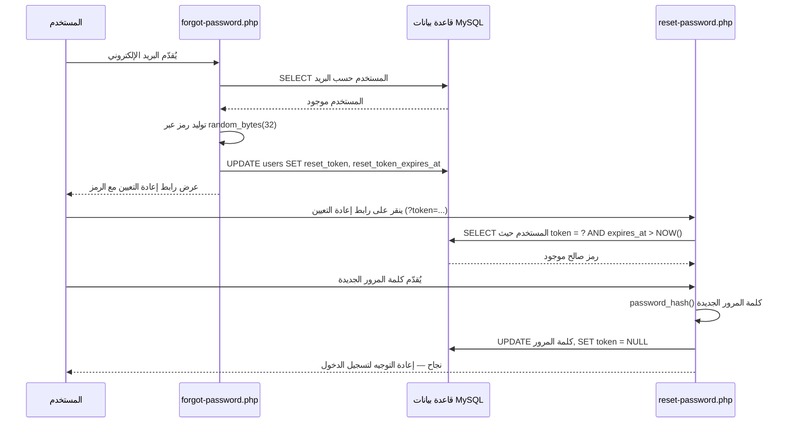
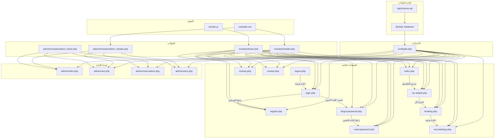

# دليلي — نظام تأجير السيارات بـ PHP (php_car_rental_anes)

> [!NOTE]
> يوثّق هذا الدليل **كل ملف** في المشروع، ويشرح وظيفته، والأدوات والتقنيات المستخدمة فيه، وكيف يرتبط ببقية النظام.

---

## فهرس المحتويات

- [نظرة عامة على المشروع](#نظرة-عامة-على-المشروع)
- [مجموعة التقنيات المستخدمة](#مجموعة-التقنيات-المستخدمة)
- [هيكل المشروع](#هيكل-المشروع)
- [1. الإعدادات وقاعدة البيانات](#1-الإعدادات-وقاعدة-البيانات)
- [2. الملفات المشتركة (القوالب)](#2-الملفات-المشتركة-القوالب)
- [3. الصفحات العامة](#3-الصفحات-العامة)
- [4. لوحة الإدارة](#4-لوحة-الإدارة)
- [5. تنسيق CSS](#5-تنسيق-css)
- [6. جافاسكريبت](#6-جافاسكريبت)
- [7. ملفات SQL](#7-ملفات-sql)
- [8. ملفات البذر والأدوات المساعدة](#8-ملفات-البذر-والأدوات-المساعدة)
- [9. الصور والموارد](#9-الصور-والموارد)
- [10. ملف README](#10-ملف-readme)
- [11. الأمان والأساليب المستخدمة](#11-الأمان-والأساليب-المستخدمة)
- [مخطط ترابط الملفات](#مخطط-ترابط-الملفات)

---

## نظرة عامة على المشروع

هذا **تطبيق ويب متكامل لتأجير السيارات** مبني بـ PHP و MySQL و HTML و CSS و JavaScript. يتيح للمستخدمين تصفح السيارات المتاحة، التسجيل/تسجيل الدخول، إجراء الحجوزات، ترك تقييمات، وإدارة حجوزاتهم. كما توفر لوحة إدارة إمكانيات إدارة السيارات والمستخدمين والحجوزات.

---

## مجموعة التقنيات المستخدمة

| الطبقة | التقنية | الغرض |
|---|---|---|
| **الخلفية (Backend)** | PHP 7+ | منطق الخادم، معالجة النماذج، إدارة الجلسات |
| **قاعدة البيانات** | MySQL (عبر MySQLi) | تخزين بيانات المستخدمين، السيارات، الحجوزات، التقييمات |
| **الواجهة الأمامية** | HTML5, CSS3 | هيكل الصفحات والتنسيق |
| **جافاسكريبت** | Vanilla JS (ES6+) | التفاعل من جانب العميل، التحقق من النماذج، الرسوم المتحركة |
| **الخادم** | XAMPP (Apache + MySQL) | بيئة التطوير المحلية |
| **الأيقونات** | Font Awesome 6.0 (CDN) | أيقونات واجهة المستخدم في التطبيق |
| **الخطوط** | Google Fonts — Inter | خطوط عصرية |
| **الأمان** | `password_hash()` / `password_verify()` (bcrypt)، العبارات المُعدّة، `htmlspecialchars()` | تشفير كلمات المرور، منع حقن SQL، منع XSS |

---

## هيكل المشروع

```
php_car_rental_anes/
├── config/
│   └── db.php                    # اتصال قاعدة البيانات
├── includes/
│   ├── header.php                # رأس HTML المشترك وشريط التنقل
│   └── footer.php                # تذييل HTML المشترك
├── admin/
│   ├── includes/
│   │   ├── admin_header.php      # رأس لوحة الإدارة والشريط الجانبي
│   │   └── admin_footer.php      # تذييل لوحة الإدارة
│   ├── index.php                 # لوحة تحكم الإدارة
│   ├── cars.php                  # إدارة السيارات (CRUD)
│   ├── reservations.php          # إدارة الحجوزات
│   └── users.php                 # إدارة المستخدمين
├── css/
│   └── style.css                 # ملف التنسيق الشامل
├── js/
│   └── main.js                   # جافاسكريبت من جانب العميل
├── sql/
│   └── schema.sql                # مخطط قاعدة البيانات (DDL)
├── images/
│   ├── hero.png                  # صورة البانر الرئيسية
│   ├── audi_q7.png               # صورة سيارة
│   ├── honda_accord.png          # صورة سيارة
│   └── cars/                     # صور سيارات إضافية
│       ├── economy.png
│       ├── mercedes_s_class.png
│       ├── porsche_911.png
│       ├── renault_clio.png
│       ├── sedan.png
│       ├── suv.png
│       ├── toyota_hilux.png
│       ├── toyota_land_cruiser.png
│       └── volkswagen_touareg.png
├── index.php                     # الصفحة الرئيسية
├── login.php                     # تسجيل دخول المستخدم
├── register.php                  # تسجيل مستخدم جديد
├── logout.php                    # تدمير الجلسة
├── forgot-password.php           # طلب استعادة كلمة المرور
├── reset-password.php            # إعادة تعيين كلمة المرور برمز
├── car-details.php               # صفحة تفاصيل السيارة
├── booking.php                   # صفحة إنشاء الحجز
├── my-bookings.php               # سجل حجوزات المستخدم
├── reviews.php                   # صفحة التقييمات
├── contact.php                   # صفحة الاتصال
├── database.sql                  # مخطط قاعدة البيانات القديم
├── seed.php                      # سكريبت بذر قاعدة البيانات
├── test_db.php                   # اختبار اتصال قاعدة البيانات
└── README.md                     # توثيق المشروع
```

---

## 1. الإعدادات وقاعدة البيانات

---

### [db.php](file:///c:/xampp/htdocs/php_car_rental_anes/config/db.php)

**الغرض:** ينشئ اتصال قاعدة البيانات المستخدم من قبل كل ملف PHP في المشروع.

**الوظيفة:**
- يُعرّف أربعة ثوابت: `DB_HOST` (`localhost`)، `DB_USER` (`root`)، `DB_PASS` (فارغ)، `DB_NAME` (`car_rental`)
- ينشئ كائن اتصال `mysqli` (`$conn`)
- يتحقق من أخطاء الاتصال ويوقف التنفيذ مع رسالة خطأ إذا فشل الاتصال
- يضبط ترميز الأحرف على `utf8` باستخدام `$conn->set_charset('utf8')`

**الأدوات والتقنيات:**
| الأداة | الاستخدام |
|---|---|
| `mysqli` (إضافة PHP) | واجهة MySQL للعمليات على قاعدة البيانات |
| `define()` | تعريف ثوابت PHP لبيانات الاتصال |
| `$conn->set_charset('utf8')` | ضمان ترميز UTF-8 الصحيح للدعم متعدد اللغات |

**الروابط:** يتم تضمين هذا الملف (`require_once`) من قبل جميع ملفات PHP التي تحتاج الوصول لقاعدة البيانات — جميع الصفحات العامة وصفحات الإدارة وسكريبتات الأدوات.

**نمط بارز:** يستخدم **أسلوب MySQLi الكائني** (`new mysqli(...)`) بدلاً من الأسلوب الإجرائي.

---

## 2. الملفات المشتركة (القوالب)

---

### [header.php](file:///c:/xampp/htdocs/php_car_rental_anes/includes/header.php)

**الغرض:** يوفر قسم `<head>` المشترك وشريط التنقل لجميع الصفحات العامة.

**الوظيفة:**
- يبدأ جلسة PHP (`session_start()`) إذا لم تكن نشطة بالفعل
- يُخرج نوع مستند HTML5، وسوم `<head>` الوصفية، وروابط الموارد الخارجية
- يعرض شريط تنقل متجاوب يحتوي على:
  - شعار يرتبط بالصفحة الرئيسية
  - روابط التنقل: الرئيسية، اتصل بنا، التقييمات
  - روابط مشروطة بناءً على حالة تسجيل الدخول:
    - **مسجّل الدخول:** حجوزاتي، تسجيل الخروج، واسم المستخدم
    - **غير مسجّل:** تسجيل الدخول، إنشاء حساب
  - رابط الإدارة (مرئي فقط للمشرفين — يتحقق من `$_SESSION['role'] === 'admin'`)
  - زر قائمة الهامبرغر للجوال

**الأدوات والتقنيات:**
| الأداة | الاستخدام |
|---|---|
| `session_start()` | إدارة جلسة PHP لحالة المصادقة |
| `$_SESSION` | المتغير العام الفائق للتحقق من حالة تسجيل الدخول ودور المستخدم |
| Font Awesome 6.0 (CDN) | مكتبة أيقونات لأيقونات التنقل |
| Google Fonts — Inter | خط sans-serif عصري يُحمّل عبر CDN |
| `htmlspecialchars()` | منع XSS عند إخراج اسم المستخدم |

**الروابط:** يتم تضمينه من قبل جميع الصفحات العامة: [index.php](file:///c:/xampp/htdocs/php_car_rental_anes/index.php)، [login.php](file:///c:/xampp/htdocs/php_car_rental_anes/login.php)، [register.php](file:///c:/xampp/htdocs/php_car_rental_anes/register.php)، [car-details.php](file:///c:/xampp/htdocs/php_car_rental_anes/car-details.php)، [booking.php](file:///c:/xampp/htdocs/php_car_rental_anes/booking.php)، [my-bookings.php](file:///c:/xampp/htdocs/php_car_rental_anes/my-bookings.php)، [contact.php](file:///c:/xampp/htdocs/php_car_rental_anes/contact.php)، [reviews.php](file:///c:/xampp/htdocs/php_car_rental_anes/reviews.php)، [forgot-password.php](file:///c:/xampp/htdocs/php_car_rental_anes/forgot-password.php)، [reset-password.php](file:///c:/xampp/htdocs/php_car_rental_anes/reset-password.php).

---

### [footer.php](file:///c:/xampp/htdocs/php_car_rental_anes/includes/footer.php)

**الغرض:** يوفر تذييل HTML المشترك ويُحمّل جافاسكريبت لجميع الصفحات العامة.

**الوظيفة:**
- يعرض عنصر `<footer>` يحتوي على:
  - اسم الشركة وإشعار حقوق النشر مع سنة ديناميكية (`date('Y')`)
  - ثلاثة أعمدة من الروابط: روابط سريعة، خدمات، معلومات الاتصال
  - روابط أيقونات وسائل التواصل الاجتماعي (فيسبوك، تويتر، إنستغرام، لينكدإن)
- يتضمن سكريبت [main.js](file:///c:/xampp/htdocs/php_car_rental_anes/js/main.js)
- يغلق وسوم `</body>` و `</html>`

**الأدوات والتقنيات:**
| الأداة | الاستخدام |
|---|---|
| `date('Y')` | دالة PHP لسنة حقوق النشر الديناميكية |
| أيقونات Font Awesome | أيقونات وسائل التواصل الاجتماعي |
| `<script src>` | تحميل ملف جافاسكريبت الرئيسي |

**الروابط:** يتم تضمينه من قبل جميع الصفحات العامة (نفس قائمة header.php).

---

## 3. الصفحات العامة

---

### [index.php](file:///c:/xampp/htdocs/php_car_rental_anes/index.php) — الصفحة الرئيسية

**الغرض:** الصفحة المقصودة للتطبيق. تعرض خدمة تأجير السيارات والسيارات المتاحة/المميزة.

**الوظيفة:**
1. يتضمن `config/db.php` و `includes/header.php`
2. يعرض **قسم البطل (Hero)** مع عنوان رئيسي وشعار وزر دعوة للعمل "تصفح السيارات"
3. يبني وينفذ **استعلام SQL ديناميكي** لجلب السيارات من قاعدة البيانات:
   - يدعم **التصفية** حسب نوع السيارة (معامل GET `type`)
   - يدعم **البحث** حسب العلامة التجارية أو الطراز (معامل GET `search`)
   - يستخدم **العبارات المُعدّة** مع ربط المعاملات للأمان
4. يعرض **شريط التصفية** بأزرار أنواع السيارات (الكل، اقتصادية، سيدان، SUV، فاخرة، بيك أب)
5. يعرض **شريط البحث** للبحث النصي عن السيارات
6. يعرض **شبكة السيارات** تُظهر كل سيارة كبطاقة تحتوي على:
   - صورة السيارة (مع عنصر نائب احتياطي)
   - العلامة التجارية، الطراز، السنة، النوع، ناقل الحركة، نوع الوقود
   - السعر لكل يوم
   - رابط "عرض التفاصيل" إلى [car-details.php](file:///c:/xampp/htdocs/php_car_rental_anes/car-details.php)
7. يعرض رسالة "لا توجد سيارات" إذا لم يُرجع الاستعلام نتائج
8. يتضمن `includes/footer.php`

**الأدوات والتقنيات:**
| الأداة | الاستخدام |
|---|---|
| العبارات المُعدّة MySQLi | `$conn->prepare()`، `bind_param()`، `execute()` لـ SQL آمن |
| `$_GET` | قراءة معاملات الاستعلام `type` و `search` |
| `htmlspecialchars()` | منع XSS على جميع قيم الإخراج |
| `number_format()` | تنسيق عرض السعر بمنزلتين عشريتين |
| بناء SQL ديناميكي | إلحاق شروط `WHERE` بشكل مشروط |

**نمط بارز:** يتم بناء استعلام SQL ديناميكيًا بإلحاق الشروط إلى مصفوفات (`$conditions`، `$params`، `$types`)، ثم دمجها — نمط نظيف للمرشحات الاختيارية.

---

### [login.php](file:///c:/xampp/htdocs/php_car_rental_anes/login.php) — تسجيل دخول المستخدم

**الغرض:** يُصادق المستخدمين ويبدأ جلستهم.

**الوظيفة:**
1. يبدأ الجلسة، يتضمن إعدادات قاعدة البيانات والرأس
2. يُعيد توجيه المستخدمين المسجلين مسبقًا إلى الصفحة الرئيسية
3. عند طلب POST:
   - يسترجع ويُنظّف `email` و `password` من النموذج
   - يتحقق من أن الحقول ليست فارغة
   - يستعلم جدول `users` عن بريد إلكتروني مطابق باستخدام **عبارة مُعدّة**
   - يتحقق من كلمة المرور باستخدام `password_verify()` (مقارنة bcrypt)
   - عند النجاح: يضبط متغيرات الجلسة (`user_id`، `name`، `email`، `role`) ويُعيد التوجيه للرئيسية
   - عند الفشل: يعرض خطأ "بريد إلكتروني أو كلمة مرور غير صحيحة"
4. يعرض نموذج تسجيل الدخول بحقول البريد الإلكتروني وكلمة المرور
5. يوفر روابط إلى [register.php](file:///c:/xampp/htdocs/php_car_rental_anes/register.php) و [forgot-password.php](file:///c:/xampp/htdocs/php_car_rental_anes/forgot-password.php)

**الأدوات والتقنيات:**
| الأداة | الاستخدام |
|---|---|
| `password_verify()` | مقارنة كلمة المرور بـ bcrypt |
| `$_SESSION` | تخزين بيانات المستخدم المُصادَق |
| `header('Location: ...')` | إعادة التوجيه HTTP بعد تسجيل الدخول الناجح |
| العبارات المُعدّة MySQLi | منع حقن SQL |
| `trim()` | تنظيف المدخلات |
| `htmlspecialchars()` | منع XSS في إعادة ملء النموذج |

---

### [register.php](file:///c:/xampp/htdocs/php_car_rental_anes/register.php) — تسجيل مستخدم جديد

**الغرض:** يسمح للمستخدمين الجدد بإنشاء حساب.

**الوظيفة:**
1. يبدأ الجلسة، يتضمن إعدادات قاعدة البيانات والرأس
2. يُعيد توجيه المستخدمين المسجلين مسبقًا إلى الصفحة الرئيسية
3. عند طلب POST:
   - يسترجع ويُنظّف `name`، `email`، `phone`، `password`، `confirm_password`
   - **سلسلة التحقق:**
     - جميع الحقول مطلوبة
     - صيغة بريد إلكتروني صالحة (`filter_var()` مع `FILTER_VALIDATE_EMAIL`)
     - الهاتف يجب أن يكون 8 أحرف على الأقل
     - كلمة المرور يجب أن تكون 6 أحرف على الأقل
     - كلمتا المرور يجب أن تتطابقا
     - البريد الإلكتروني يجب ألا يكون موجودًا مسبقًا في قاعدة البيانات (فحص التفرد عبر عبارة مُعدّة)
   - عند صحة المدخلات: يُشفّر كلمة المرور بـ `password_hash()` (bcrypt)، يُدخل المستخدم بـ `role = 'user'`
   - يضبط متغيرات الجلسة ويُعيد التوجيه للرئيسية
4. يعرض نموذج التسجيل بجميع الحقول
5. يوفر رابطًا إلى [login.php](file:///c:/xampp/htdocs/php_car_rental_anes/login.php)

**الأدوات والتقنيات:**
| الأداة | الاستخدام |
|---|---|
| `password_hash($password, PASSWORD_DEFAULT)` | تشفير bcrypt لتخزين آمن لكلمات المرور |
| `filter_var()` مع `FILTER_VALIDATE_EMAIL` | التحقق من البريد الإلكتروني من جانب الخادم |
| `strlen()` | التحقق من طول الهاتف وكلمة المرور |
| العبارات المُعدّة MySQLi | INSERT و SELECT مع ربط المعاملات |
| `$conn->insert_id` | استرجاع المعرف المُولّد تلقائيًا للمستخدم الجديد |

---

### [logout.php](file:///c:/xampp/htdocs/php_car_rental_anes/logout.php) — تدمير الجلسة

**الغرض:** يُسجّل خروج المستخدم بتدمير جلسته.

**الوظيفة:**
1. يبدأ الجلسة (للوصول إليها)
2. يستدعي `session_unset()` لمسح جميع متغيرات الجلسة
3. يستدعي `session_destroy()` لتدمير الجلسة على الخادم
4. يُعيد توجيه المستخدم إلى [login.php](file:///c:/xampp/htdocs/php_car_rental_anes/login.php)

**الأدوات والتقنيات:**
| الأداة | الاستخدام |
|---|---|
| `session_start()` | استئناف الجلسة لتدميرها |
| `session_unset()` | مسح جميع متغيرات `$_SESSION` |
| `session_destroy()` | تدمير بيانات الجلسة على الخادم |
| `header('Location: login.php')` | إعادة التوجيه لصفحة تسجيل الدخول |

**نمط بارز:** هذا ملف بسيط أحادي الغرض — لا يحتوي على مخرجات HTML، فقط تنظيف الجلسة وإعادة التوجيه.

---

### [forgot-password.php](file:///c:/xampp/htdocs/php_car_rental_anes/forgot-password.php) — طلب استعادة كلمة المرور

**الغرض:** يسمح للمستخدمين بطلب رابط إعادة تعيين كلمة المرور عبر إدخال بريدهم الإلكتروني.

**الوظيفة:**
1. يتضمن إعدادات قاعدة البيانات والرأس
2. عند طلب POST:
   - يتحقق من وجود البريد الإلكتروني في جدول `users`
   - يُولّد **رمز عشوائي مشفّر** باستخدام `bin2hex(random_bytes(32))`
   - يحسب وقت انتهاء صلاحية الرمز (ساعة من الآن) باستخدام `date('Y-m-d H:i:s', strtotime('+1 hour'))`
   - يُخزّن الرمز وتاريخ انتهاء صلاحيته في جدول `users` عبر استعلام UPDATE
   - يبني رابط إعادة التعيين: `reset-password.php?token=<token>`
   - يعرض رابط إعادة التعيين مباشرة على الصفحة (يحاكي إرسال البريد الإلكتروني للتطوير)
3. يعرض نموذجًا بحقل إدخال البريد الإلكتروني

**الأدوات والتقنيات:**
| الأداة | الاستخدام |
|---|---|
| `random_bytes(32)` | توليد بايتات عشوائية مشفّرة |
| `bin2hex()` | تحويل الرمز الثنائي إلى سلسلة سداسية عشرية (64 حرف) |
| `strtotime('+1 hour')` | حساب الطابع الزمني لانتهاء الصلاحية |
| `date('Y-m-d H:i:s')` | تنسيق التاريخ والوقت لتخزينه في MySQL |
| العبارات المُعدّة MySQLi | استعلامات SELECT و UPDATE |

> [!IMPORTANT]
> في الإنتاج، يجب إرسال رابط إعادة التعيين عبر البريد الإلكتروني (مثلاً باستخدام PHPMailer أو `mail()`). حاليًا، يتم عرض الرابط على الشاشة لأغراض التطوير.

---

### [reset-password.php](file:///c:/xampp/htdocs/php_car_rental_anes/reset-password.php) — إعادة تعيين كلمة المرور

**الغرض:** يسمح للمستخدمين بتعيين كلمة مرور جديدة باستخدام رمز إعادة تعيين صالح.

**الوظيفة:**
1. يقرأ `token` من `$_GET`
2. يتحقق من وجود الرمز في قاعدة البيانات وعدم انتهاء صلاحيته (`reset_expiry > NOW()`)
3. عند طلب POST:
   - يتحقق من كلمة المرور الجديدة (6 أحرف كحد أدنى)
   - يتحقق من تطابق كلمتي المرور
   - يُشفّر كلمة المرور الجديدة بـ `password_hash()`
   - يُحدّث كلمة مرور المستخدم ويمسح حقول الرمز/انتهاء الصلاحية (يضبطها على `NULL`)
   - يعرض رسالة نجاح مع رابط لتسجيل الدخول
4. إذا كان الرمز غير صالح أو منتهي الصلاحية، يعرض رسالة خطأ

**الأدوات والتقنيات:**
| الأداة | الاستخدام |
|---|---|
| `password_hash()` | تشفير bcrypt لكلمة المرور الجديدة |
| دالة MySQL `NOW()` | مقارنة الوقت من جانب الخادم لانتهاء صلاحية الرمز |
| العبارات المُعدّة MySQLi | التحقق من الرمز وتحديث كلمة المرور |
| `$_GET['token']` | قراءة الرمز من الرابط |

---

### [car-details.php](file:///c:/xampp/htdocs/php_car_rental_anes/car-details.php) — صفحة تفاصيل السيارة

**الغرض:** يعرض التفاصيل الكاملة لسيارة معينة وتقييماتها. يسمح للمستخدمين المسجلين بتقديم تقييمات.

**الوظيفة:**
1. يقرأ `car_id` من `$_GET` ويتحقق من أنه عدد صحيح
2. يجلب تفاصيل السيارة من جدول `cars`
3. يعرض رسالة 404 إذا لم يتم العثور على السيارة
4. يعرض:
   - صورة سيارة كبيرة مع شارة التوفر
   - المواصفات الكاملة: العلامة التجارية، الطراز، السنة، النوع، ناقل الحركة، نوع الوقود، المقاعد، السعر
   - زر "احجز الآن" (يرتبط بـ [booking.php](file:///c:/xampp/htdocs/php_car_rental_anes/booking.php))
5. **قسم التقييمات:**
   - يجلب جميع التقييمات لهذه السيارة من جدول `reviews` (JOIN مع `users`)
   - يعرض كل تقييم مع تصنيف النجوم واسم المُقيّم والتاريخ والتعليق
   - يحسب ويعرض متوسط التقييم
6. **نموذج تقديم التقييم** (مرئي فقط للمستخدمين المسجلين):
   - عند POST: يُدخل تقييمًا جديدًا بـ `user_id`، `car_id`، `rating`، `comment`
   - يُعيد التوجيه لنفس الصفحة لعرض التقييم الجديد

**الأدوات والتقنيات:**
| الأداة | الاستخدام |
|---|---|
| `intval()` | تحويل car_id إلى عدد صحيح للأمان |
| استعلام `JOIN` SQL | ربط `reviews` مع `users` للحصول على أسماء المُقيّمين |
| دالة SQL `AVG()` | حساب متوسط التقييم |
| `ORDER BY created_at DESC` | ترتيب التقييمات من الأحدث |
| `str_repeat()` | توليد أيقونات النجوم (★) للتقييمات |
| `date('M d, Y')` | تنسيق تواريخ التقييمات |
| العبارات المُعدّة MySQLi | جميع استعلامات قاعدة البيانات |

---

### [booking.php](file:///c:/xampp/htdocs/php_car_rental_anes/booking.php) — صفحة الحجز / الحجز

**الغرض:** يسمح للمستخدمين المسجلين بإنشاء حجز تأجير سيارة.

**الوظيفة:**
1. **فحص المصادقة:** يُعيد التوجيه لتسجيل الدخول إذا لم يكن مسجلاً
2. يقرأ `car_id` من `$_GET`، يتحقق ويجلب السيارة
3. عند طلب POST:
   - يقرأ `pickup_date`، `return_date`، `pickup_location` من النموذج
   - **التحقق:**
     - جميع الحقول مطلوبة
     - تاريخ الاستلام يجب أن يكون اليوم أو بعده
     - تاريخ الإرجاع يجب أن يكون بعد تاريخ الاستلام
   - **حساب السعر:** يحسب عدد الأيام (فرق `DateTime`) ويضربه في السعر اليومي
   - **فحص التوفر:** يستعلم عن الحجوزات الحالية للتداخل الزمني باستخدام منطق SQL `NOT (return_date < ? OR pickup_date > ?)`
   - إذا كانت متاحة: يُدخل حجزًا جديدًا بحالة `'pending'` والسعر الإجمالي
   - إذا لم تكن متاحة: يعرض خطأ حول التواريخ المتعارضة
   - يُعيد التوجيه إلى [my-bookings.php](file:///c:/xampp/htdocs/php_car_rental_anes/my-bookings.php) عند النجاح
4. يعرض نموذج الحجز مع:
   - ملخص السيارة (صورة، اسم، سعر)
   - منتقيات تاريخ الاستلام والإرجاع
   - حقل نصي لموقع الاستلام

**الأدوات والتقنيات:**
| الأداة | الاستخدام |
|---|---|
| فئة `DateTime` | حساب فرق التواريخ للتسعير |
| `$interval->days` | عدد الأيام بين الاستلام والإرجاع |
| استعلام تداخل التواريخ SQL | التحقق من الحجوزات المتعارضة |
| `date('Y-m-d')` | تاريخ اليوم للتحقق من الحد الأدنى للتاريخ |
| `number_format()` | تنسيق السعر الإجمالي المحسوب |
| العبارات المُعدّة MySQLi | SELECT للتوفر، INSERT للحجز الجديد |

**نمط بارز:** يستخدم فحص التوفر أسلوب **المُكمّل** — `NOT (end_before_start OR start_after_end)` — وهو الخوارزمية القياسية لاكتشاف تداخل نطاقات التواريخ.

---

### [my-bookings.php](file:///c:/xampp/htdocs/php_car_rental_anes/my-bookings.php) — سجل حجوزات المستخدم

**الغرض:** يعرض جميع الحجوزات التي أجراها المستخدم المسجل حاليًا.

**الوظيفة:**
1. **فحص المصادقة:** يُعيد التوجيه لتسجيل الدخول إذا لم يكن مسجلاً
2. **معالج إلغاء الحجز:** إذا تم استلام طلب POST بـ `cancel_booking_id`:
   - يتحقق من أن الحجز ينتمي للمستخدم الحالي
   - يُحدّث حالته إلى `'cancelled'`
3. يجلب جميع حجوزات المستخدم (JOIN مع جدول `cars`)، مرتبة حسب تاريخ الإنشاء تنازليًا
4. يعرض جدول/قائمة بطاقات تحتوي على:
   - صورة السيارة، العلامة التجارية، الطراز
   - تواريخ الاستلام والإرجاع
   - السعر الإجمالي
   - شارة الحالة (بألوان: معلّق=برتقالي، مؤكّد=أخضر، ملغى=أحمر، مكتمل=أزرق)
   - زر الإلغاء (فقط للحجوزات `pending` أو `confirmed`)
5. يعرض رسالة "لا توجد حجوزات بعد" مع رابط للصفحة الرئيسية إذا كانت فارغة

**الأدوات والتقنيات:**
| الأداة | الاستخدام |
|---|---|
| `JOIN` SQL | ربط `reservations` مع `cars` لتفاصيل السيارة |
| تنسيق بناءً على الحالة | تعيين فئة CSS ديناميكية بناءً على حالة الحجز |
| `date('M d, Y')` | تنسيق التواريخ للعرض |
| `number_format()` | تنسيق السعر |
| `$_POST['cancel_booking_id']` | الإلغاء عبر نموذج POST |
| العبارات المُعدّة MySQLi | جميع الاستعلامات تستخدم ربط المعاملات |

---

### [reviews.php](file:///c:/xampp/htdocs/php_car_rental_anes/reviews.php) — صفحة جميع التقييمات

**الغرض:** يعرض جميع التقييمات عبر جميع السيارات، ويعمل كصفحة شهادات.

**الوظيفة:**
1. يجلب جميع التقييمات من قاعدة البيانات باستخدام **JOIN ثلاثي** (`reviews` ← `users` ← `cars`)
2. يرتب التقييمات حسب `created_at DESC` (الأحدث أولاً)
3. يعرض كل تقييم كبطاقة تحتوي على:
   - اسم المُقيّم
   - العلامة التجارية والطراز للسيارة
   - تصنيف النجوم (مرئي)
   - نص التعليق
   - تاريخ النشر
4. يعرض رسالة "لا توجد تقييمات بعد" إذا كان الجدول فارغًا

**الأدوات والتقنيات:**
| الأداة | الاستخدام |
|---|---|
| JOIN متعدد الجداول | `reviews JOIN users JOIN cars` للعرض غير المُطبّع |
| `str_repeat('★', $rating)` | توليد أيقونات النجوم المملوءة |
| `str_repeat('☆', 5 - $rating)` | توليد أيقونات النجوم الفارغة |
| `htmlspecialchars()` | منع XSS على جميع المخرجات |
| `date('M d, Y')` | تنسيق التاريخ |

---

### [contact.php](file:///c:/xampp/htdocs/php_car_rental_anes/contact.php) — صفحة الاتصال

**الغرض:** يوفر نموذج اتصال ومعلومات اتصال الشركة.

**الوظيفة:**
1. عند طلب POST:
   - يقرأ `name`، `email`، `subject`، `message` من النموذج
   - يتحقق من ملء جميع الحقول
   - يتحقق من صيغة البريد الإلكتروني بـ `filter_var()`
   - يعرض رسالة نجاح (لا يتم إرسال بريد فعلي — عنصر نائب للتطوير)
2. يعرض الصفحة مع:
   - **قسم معلومات الاتصال** مع الهاتف والبريد والعنوان وساعات العمل
   - **نموذج اتصال** بحقول الاسم والبريد والموضوع والرسالة
   - أيقونات Font Awesome لكل وسيلة اتصال

**الأدوات والتقنيات:**
| الأداة | الاستخدام |
|---|---|
| `filter_var()` مع `FILTER_VALIDATE_EMAIL` | التحقق من البريد الإلكتروني |
| `trim()` | تنظيف المدخلات |
| `htmlspecialchars()` | منع XSS في قيم إعادة ملء النموذج |
| أيقونات Font Awesome | مؤشرات بصرية لوسائل الاتصال |

> [!NOTE]
> نموذج الاتصال حاليًا يتحقق فقط ويعرض رسالة نجاح. في الإنتاج، يجب إرسال بريد إلكتروني (عبر `mail()` أو PHPMailer) أو تخزين الرسالة في قاعدة البيانات.

---

## 4. لوحة الإدارة

---

### [admin/index.php](file:///c:/xampp/htdocs/php_car_rental_anes/admin/index.php) — لوحة تحكم الإدارة

**الغرض:** لوحة تحكم الإدارة الرئيسية التي تعرض الإحصائيات الرئيسية والنشاط الأخير.

**الوظيفة:**
1. **فحص التفويض:** يتحقق من أن المستخدم مسجل الدخول وله `role === 'admin'`؛ يُعيد التوجيه للصفحة الرئيسية العامة في حالة عدم التحقق
2. يجلب **إحصائيات لوحة التحكم** باستخدام استعلامات SQL تجميعية:
   - إجمالي عدد السيارات (`SELECT COUNT(*) FROM cars`)
   - إجمالي عدد المستخدمين (`SELECT COUNT(*) FROM users`)
   - إجمالي عدد الحجوزات (`SELECT COUNT(*) FROM reservations`)
   - إجمالي الإيرادات من الحجوزات المؤكدة/المكتملة (`SELECT SUM(total_price) FROM reservations WHERE status IN ('confirmed','completed')`)
3. يجلب **أحدث 5 حجوزات** (JOIN مع `users` و `cars`)
4. يعرض:
   - أربع بطاقات إحصائية (إجمالي السيارات، إجمالي المستخدمين، إجمالي الحجوزات، إجمالي الإيرادات)
   - جدول "الحجوزات الأخيرة" مع اسم المستخدم والسيارة والتواريخ والسعر الإجمالي والحالة

**الأدوات والتقنيات:**
| الأداة | الاستخدام |
|---|---|
| دالة SQL `COUNT(*)` التجميعية | عدّ السجلات للإحصائيات |
| دالة SQL `SUM()` التجميعية | جمع الإيرادات |
| `WHERE status IN (...)` | تصفية الحجوزات المُدرّة للإيرادات فقط |
| `LIMIT 5` | تحديد أحدث الحجوزات |
| JOIN متعدد الجداول | `reservations JOIN users JOIN cars` |
| `number_format()` | تنسيق قيم العملة |
| التحكم في الوصول المبني على الأدوار | فحص المشرف عبر الجلسة |

---

### [admin/cars.php](file:///c:/xampp/htdocs/php_car_rental_anes/admin/cars.php) — إدارة السيارات (CRUD)

**الغرض:** واجهة CRUD كاملة (إنشاء، قراءة، تحديث، حذف) لإدارة مخزون السيارات.

**الوظيفة:**
1. **فحص التفويض** (نفس لوحة التحكم)
2. **يعالج أربع عمليات بناءً على `$_GET['action']`:**
   - **`add` (POST):** إدخال سيارة جديدة بالعلامة التجارية والطراز والسنة والنوع والسعر والصورة والمقاعد وناقل الحركة ونوع الوقود وحالة التوفر
   - **`edit` (POST):** تحديث تفاصيل سيارة موجودة
   - **`delete` (GET):** حذف سيارة بالمعرف
   - **الافتراضي (بدون إجراء):** عرض قائمة جميع السيارات
3. **نموذج إضافة سيارة:** نموذج كامل بمدخلات نصية وقوائم منسدلة (النوع، ناقل الحركة، نوع الوقود، التوفر) ومدخلات أرقام
4. **نموذج تعديل السيارة:** نموذج مُعبّأ مسبقًا يتم جلبه عبر معرف السيارة
5. **قائمة السيارات:** جدول يعرض جميع السيارات مع صورة مصغرة والعلامة التجارية والطراز والسنة والنوع والسعر وشارة الحالة وأزرار تعديل/حذف

**الأدوات والتقنيات:**
| الأداة | الاستخدام |
|---|---|
| `$_GET['action']` | التوجيه لعرض إضافة/تعديل/حذف |
| العبارات المُعدّة MySQLi | جميع استعلامات INSERT و UPDATE و DELETE و SELECT |
| `intval()` | تحويل المعرفات إلى أعداد صحيحة |
| `htmlspecialchars()` | منع XSS على جميع مخرجات النماذج |
| `number_format()` | تنسيق السعر |
| عناصر HTML `<select>` | محددات منسدلة للنوع وناقل الحركة والوقود |
| منطق سمة `selected` | اختيار القيم الحالية مسبقًا في نموذج التعديل |

**نمط بارز:** يستخدم نمط توجيه الملف الواحد — يتم تحديد الإجراء بمعامل GET، ويعالج الملف جميع عمليات CRUD في مكان واحد. هذا نمط شائع في PHP للوحات الإدارة.

---

### [admin/reservations.php](file:///c:/xampp/htdocs/php_car_rental_anes/admin/reservations.php) — إدارة الحجوزات

**الغرض:** يسمح للمشرفين بعرض جميع الحجوزات وتحديث حالاتها.

**الوظيفة:**
1. **فحص التفويض**
2. **معالج تحديث الحالة:** عند POST بـ `reservation_id` و `status`:
   - يُحدّث حالة الحجز (معلّق، مؤكّد، ملغى، مكتمل)
   - يستخدم عبارة مُعدّة لـ UPDATE
3. يجلب جميع الحجوزات باستخدام JOIN متعدد الجداول (reservations + users + cars)، مرتبة حسب تاريخ الإنشاء تنازليًا
4. يعرض جدولاً يحتوي على:
   - معرف الحجز
   - اسم العميل
   - السيارة (العلامة + الطراز)
   - تواريخ الاستلام والإرجاع
   - السعر الإجمالي
   - شارة الحالة (بألوان مميزة)
   - **نموذج تحديث الحالة:** قائمة منسدلة مضمّنة بجميع خيارات الحالة الأربع وزر "تحديث"

**الأدوات والتقنيات:**
| الأداة | الاستخدام |
|---|---|
| JOIN متعدد الجداول | `reservations JOIN users JOIN cars` |
| `$_POST['status']` | الحالة الجديدة من النموذج المضمّن |
| `<form>` مضمّن | كل صف له نموذجه الخاص لتحديث الحالة |
| `<select>` مع `selected` | يختار الحالة الحالية مسبقًا |
| ترميز الحالة بالألوان | تمييز بصري بين حالات الحجز |
| `number_format()` | تنسيق السعر |
| `date('M d, Y')` | تنسيق التاريخ |

---

### [admin/users.php](file:///c:/xampp/htdocs/php_car_rental_anes/admin/users.php) — إدارة المستخدمين

**الغرض:** يسمح للمشرفين بعرض جميع المستخدمين المسجلين وعدد حجوزاتهم.

**الوظيفة:**
1. **فحص التفويض**
2. يجلب جميع المستخدمين مع **LEFT JOIN** و **GROUP BY** لعدّ حجوزات كل مستخدم:
   ```sql
   SELECT users.*, COUNT(reservations.id) as booking_count
   FROM users
   LEFT JOIN reservations ON users.id = reservations.user_id
   GROUP BY users.id
   ORDER BY users.created_at DESC
   ```
3. يعرض جدولاً يحتوي على:
   - معرف المستخدم
   - الاسم
   - البريد الإلكتروني
   - الهاتف
   - الدور (مستخدم/مشرف)
   - عدد الحجوزات
   - تاريخ التسجيل

**الأدوات والتقنيات:**
| الأداة | الاستخدام |
|---|---|
| `LEFT JOIN` | يشمل المستخدمين بدون حجوزات |
| `COUNT()` مع `GROUP BY` | تجميع عدد الحجوزات لكل مستخدم |
| `$conn->query()` | استعلام مباشر (لا يوجد مدخل مستخدم = لا خطر حقن) |
| `date('M d, Y')` | تنسيق التاريخ |
| `ucfirst()` | تحويل أسماء الأدوار لحروف كبيرة للعرض |

---

### [admin/includes/admin_header.php](file:///c:/xampp/htdocs/php_car_rental_anes/admin/includes/admin_header.php) — رأس الإدارة والشريط الجانبي

**الغرض:** يوفر رأس HTML والتنقل عبر الشريط الجانبي والشريط العلوي للوحة الإدارة.

**الوظيفة:**
1. يبدأ الجلسة
2. يُخرج رأس HTML5 مع:
   - Font Awesome 6.0 CDN
   - Google Fonts (Inter)
   - مرجع لـ [style.css](file:///c:/xampp/htdocs/php_car_rental_anes/css/style.css) المشترك
3. يعرض **شريطًا جانبيًا** بروابط التنقل:
   - لوحة التحكم (`admin/index.php`)
   - إدارة السيارات (`admin/cars.php`)
   - الحجوزات (`admin/reservations.php`)
   - المستخدمون (`admin/users.php`)
   - العودة للموقع (الصفحة الرئيسية العامة)
   - تسجيل الخروج
4. يُبرز **الصفحة النشطة** بمقارنة `basename($_SERVER['PHP_SELF'])` مع كل رابط

**الأدوات والتقنيات:**
| الأداة | الاستخدام |
|---|---|
| `basename($_SERVER['PHP_SELF'])` | تحديد الصفحة الحالية لإبراز التنقل النشط |
| أيقونات Font Awesome | أيقونات التنقل في الشريط الجانبي |
| العامل الثلاثي | تعيين فئة CSS مشروط للحالة النشطة |
| `$_SESSION['name']` | عرض اسم المشرف في الشريط العلوي |

---

### [admin/includes/admin_footer.php](file:///c:/xampp/htdocs/php_car_rental_anes/admin/includes/admin_footer.php) — تذييل الإدارة

**الغرض:** يغلق هيكل HTML لصفحات الإدارة.

**الوظيفة:**
- يُخرج وسوم إغلاق `</div>` و `</body>` و `</html>`
- ملف بسيط (لا يحتوي على مراجع جافاسكريبت في لوحة الإدارة)

---

## 5. تنسيق CSS

---

### [style.css](file:///c:/xampp/htdocs/php_car_rental_anes/css/style.css)

**الغرض:** ملف التنسيق الشامل الوحيد للتطبيق بأكمله (الصفحات العامة ولوحة الإدارة).

**الوظيفة والتنظيم:**
الملف يحتوي على حوالي **600+ سطر** مُنظّمة في الأقسام الرئيسية التالية:

| القسم | الوصف |
|---|---|
| **متغيرات CSS (`:root`)** | رموز التصميم: اللون الأساسي (`#e63946`)، الثانوي (`#1d3557`)، خلفية داكنة، خلفية فاتحة، نصف قطر الحدود، ظل الصندوق، سرعة الانتقال |
| **إعادة التعيين والأساس** | box-sizing عالمي، خط الجسم (Inter)، الخلفية، ارتفاع السطر |
| **التنقل** | شريط تنقل ثابت، تخطيط flex، تنسيق الشعار، روابط التنقل مع تأثيرات التمرير، قائمة الهامبرغر للجوال |
| **قسم البطل** | بطل بملء الشاشة مع صورة خلفية وتدرج شفاف ونص متوسط وزر CTA متحرك |
| **التصفية والبحث** | أزرار تصفية أنواع السيارات، تنسيق شريط البحث، إبراز الحالة النشطة |
| **شبكة السيارات** | تخطيط CSS Grid (`grid-template-columns: repeat(auto-fill, minmax(300px, 1fr))`)، تنسيق بطاقات السيارات مع تحويل التمرير وتأثيرات الظل |
| **تفاصيل السيارة** | تخطيط عمودين لصفحة تفاصيل السيارة، شبكة المواصفات، تنسيق الصور |
| **النماذج** | نماذج المصادقة (تسجيل الدخول/التسجيل)، نموذج الحجز، نموذج الاتصال — تنسيق متسق مع حالات التركيز والانتقالات |
| **التقييمات** | بطاقات التقييمات، عرض تصنيف النجوم، تنسيق نموذج التقييم |
| **جدول الحجوزات** | بطاقات/جدول حجوزاتي، شارات الحالة بترميز الألوان |
| **التذييل** | تخطيط تذييل متعدد الأعمدة، روابط وسائل التواصل الاجتماعي، تأثيرات التمرير |
| **لوحة الإدارة** | تخطيط الشريط الجانبي (250 بكسل ثابت)، منطقة المحتوى الرئيسي، بطاقات إحصائيات لوحة التحكم، جداول الإدارة، نماذج الإدارة |
| **التصميم المتجاوب** | استعلامات الوسائط للأجهزة اللوحية (`max-width: 768px`) والجوال (`max-width: 480px`) |
| **الرسوم المتحركة** | `@keyframes fadeIn` لرسوم متحركة عند تحميل الصفحة |

**الأدوات والتقنيات:**
| الأداة | الاستخدام |
|---|---|
| خصائص CSS المخصصة | `var(--primary-color)`، `var(--secondary-color)`، إلخ للتخصيص |
| CSS Grid | تخطيط شبكة السيارات مع `auto-fill` و `minmax()` |
| Flexbox | التنقل، تخطيطات البطاقات، تخطيطات النماذج |
| انتقالات CSS | `transition: all 0.3s ease` لتأثيرات تمرير سلسة |
| `@keyframes` | رسوم `fadeIn` المتحركة لعناصر الصفحة |
| استعلامات الوسائط | نقاط توقف متجاوبة عند 768 بكسل و 480 بكسل |
| `position: sticky` | شريط تنقل ثابت |
| `transform: translateY(-5px)` | تأثير رفع البطاقة عند التمرير |
| تدرجات شفافة | تدرج `linear-gradient` لقسم البطل |
| `box-shadow` | تأثيرات ارتفاع على البطاقات والأزرار |

**نمط بارز:** يستخدم التطبيق بأكمله **نظام رموز تصميم** عبر متغيرات CSS، مما يجعل تغيير السمات (الألوان، المسافات، الظلال) سهلاً على المستوى العالمي.

---

## 6. جافاسكريبت

---

### [main.js](file:///c:/xampp/htdocs/php_car_rental_anes/js/main.js)

**الغرض:** التفاعل من جانب العميل، التحقق من النماذج، الرسوم المتحركة، وتحسينات تجربة المستخدم.

**الوظيفة والميزات:**

| الميزة | الوصف |
|---|---|
| **تبديل قائمة الجوال** | يُبدّل ظهور `.nav-links` عند النقر على أيقونة الهامبرغر؛ يضيف فئة `active` |
| **التمرير السلس** | يعترض نقرات روابط المرساة ويستخدم `element.scrollIntoView({ behavior: 'smooth' })` |
| **رسوم التمرير المتحركة** | يستخدم `IntersectionObserver` لاكتشاف دخول العناصر ذات `.animate-on-scroll` في نافذة العرض، مما يُشغّل رسوم CSS المتحركة |
| **التحقق من النماذج** | التحقق من جانب العميل لنماذج تسجيل الدخول والتسجيل والحجز والاتصال: فحص الحقول الفارغة، صيغة البريد (regex)، طول كلمة المرور، تطابق كلمات المرور، صلاحية التواريخ |
| **حاسبة سعر الحجز** | تقدير السعر في الوقت الفعلي: يستمع لتغييرات مدخلات التاريخ، يحسب عدد الأيام، ويعرض السعر الإجمالي المقدّر ديناميكيًا |
| **تفاعل تصنيف النجوم** | يجعل نجوم التقييم تفاعلية — التمرير يُبرز النجوم، النقر يضبط قيمة المدخل المخفي |
| **رسائل الفلاش** | تلاشي تلقائي لرسائل التنبيه النجاح/الخطأ بعد 5 ثوانٍ باستخدام `setTimeout` وانتقال الشفافية |
| **تأثير شريط التنقل عند التمرير** | يضيف فئة `scrolled` لشريط التنقل عند التمرير (`window.scrollY > 50`)، مما يُشغّل تغييرًا بصريًا (ظل/خلفية) |

**الأدوات والتقنيات:**
| الأداة | الاستخدام |
|---|---|
| `document.addEventListener('DOMContentLoaded')` | ضمان جاهزية DOM قبل ربط المعالجات |
| واجهة `IntersectionObserver` | رسوم متحركة فعالة عند التمرير (بدون مستمعي أحداث التمرير) |
| `querySelector` / `querySelectorAll` | اختيار عناصر DOM |
| `addEventListener` | معالجة الأحداث للنقرات والإرسالات والتمرير وتغييرات المدخلات |
| `element.scrollIntoView()` | واجهة التمرير السلس الأصلية |
| `setTimeout` | إزالة رسائل الفلاش المؤجلة |
| `new Date()` | حساب التاريخ لسعر الحجز |
| التعبير النمطي | التحقق من البريد: `/^[^\s@]+@[^\s@]+\.[^\s@]+$/` |
| `element.classList.add/remove/toggle` | معالجة فئات CSS للرسوم المتحركة والحالات |
| `event.preventDefault()` | منع إرسال النموذج الافتراضي للتحقق |

**نمط بارز:** يستخدم **واجهة IntersectionObserver** للرسوم المتحركة عند التمرير — وهو بديل حديث وفعال بدلاً من الاستماع لأحداث التمرير وفحص مواقع العناصر يدويًا.

---

## 7. ملفات SQL

---

### [schema.sql](file:///c:/xampp/htdocs/php_car_rental_anes/sql/schema.sql)

**الغرض:** ملف تعريف مخطط قاعدة البيانات الرئيسي. ينشئ قاعدة البيانات وجميع الجداول.

**الوظيفة:**
1. ينشئ قاعدة بيانات `car_rental` إذا لم تكن موجودة
2. يختار قاعدة البيانات بـ `USE car_rental`
3. ينشئ **أربعة جداول** بـ `CREATE TABLE IF NOT EXISTS`:

#### جدول: `users`
| العمود | النوع | التفاصيل |
|---|---|---|
| `id` | INT AUTO_INCREMENT | المفتاح الأساسي |
| `name` | VARCHAR(100) | NOT NULL |
| `email` | VARCHAR(100) | NOT NULL, UNIQUE |
| `phone` | VARCHAR(20) | يقبل NULL |
| `password` | VARCHAR(255) | NOT NULL (يُخزّن تشفير bcrypt) |
| `role` | ENUM('user','admin') | DEFAULT 'user' |
| `reset_token` | VARCHAR(64) | يقبل NULL (لإعادة تعيين كلمة المرور) |
| `reset_expiry` | DATETIME | يقبل NULL (انتهاء صلاحية الرمز) |
| `created_at` | TIMESTAMP | DEFAULT CURRENT_TIMESTAMP |

#### جدول: `cars`
| العمود | النوع | التفاصيل |
|---|---|---|
| `id` | INT AUTO_INCREMENT | المفتاح الأساسي |
| `brand` | VARCHAR(50) | NOT NULL |
| `model` | VARCHAR(50) | NOT NULL |
| `year` | INT | NOT NULL |
| `type` | ENUM('economy','sedan','suv','luxury','pickup') | NOT NULL |
| `price_per_day` | DECIMAL(10,2) | NOT NULL |
| `image` | VARCHAR(255) | يقبل NULL |
| `seats` | INT | DEFAULT 5 |
| `transmission` | ENUM('automatic','manual') | DEFAULT 'automatic' |
| `fuel_type` | ENUM('petrol','diesel','electric','hybrid') | DEFAULT 'petrol' |
| `available` | BOOLEAN | DEFAULT TRUE |
| `created_at` | TIMESTAMP | DEFAULT CURRENT_TIMESTAMP |

#### جدول: `reservations`
| العمود | النوع | التفاصيل |
|---|---|---|
| `id` | INT AUTO_INCREMENT | المفتاح الأساسي |
| `user_id` | INT | FK → `users(id)` مع حذف متتالي |
| `car_id` | INT | FK → `cars(id)` مع حذف متتالي |
| `pickup_date` | DATE | NOT NULL |
| `return_date` | DATE | NOT NULL |
| `pickup_location` | VARCHAR(255) | يقبل NULL |
| `total_price` | DECIMAL(10,2) | NOT NULL |
| `status` | ENUM('pending','confirmed','cancelled','completed') | DEFAULT 'pending' |
| `created_at` | TIMESTAMP | DEFAULT CURRENT_TIMESTAMP |

#### جدول: `reviews`
| العمود | النوع | التفاصيل |
|---|---|---|
| `id` | INT AUTO_INCREMENT | المفتاح الأساسي |
| `user_id` | INT | FK → `users(id)` مع حذف متتالي |
| `car_id` | INT | FK → `cars(id)` مع حذف متتالي |
| `rating` | INT | NOT NULL (1–5) |
| `comment` | TEXT | يقبل NULL |
| `created_at` | TIMESTAMP | DEFAULT CURRENT_TIMESTAMP |

**الأدوات والتقنيات:**
| الأداة | الاستخدام |
|---|---|
| MySQL DDL | `CREATE DATABASE`، `CREATE TABLE`، `ALTER TABLE` |
| نوع `ENUM` | تقييد القيم لحقول الحالة والنوع والدور |
| قيود `FOREIGN KEY` | سلامة المراجع بين الجداول |
| `ON DELETE CASCADE` | التنظيف التلقائي عند حذف السجلات الأصل |
| `AUTO_INCREMENT` | توليد المعرفات تلقائيًا |
| `DECIMAL(10,2)` | تخزين دقيق للقيم النقدية |
| `BOOLEAN` | علم توفر السيارة |

---

### [database.sql](file:///c:/xampp/htdocs/php_car_rental_anes/database.sql)

**الغرض:** ملف مخطط قاعدة بيانات قديم/بديل. يحتوي على DDL مشابه لـ `schema.sql` لكنه قد يمثل نسخة سابقة.

**الوظيفة:**
- ينشئ نفس الجداول الأربعة (`users`، `cars`، `reservations`، `reviews`)
- يتضمن عبارة `INSERT` لإنشاء مستخدم مشرف افتراضي:
  ```sql
  INSERT INTO users (name, email, password, role)
  VALUES ('Admin', 'admin@carrental.com', '<bcrypt_hash>', 'admin')
  ```

**الأدوات والتقنيات:** نفس `schema.sql`.

> [!NOTE]
> يبدو أن هذا الملف نسخة سابقة أو بديلة من المخطط. المخطط الأساسي هو [sql/schema.sql](file:///c:/xampp/htdocs/php_car_rental_anes/sql/schema.sql).

---

## 8. ملفات البذر والأدوات المساعدة

---

### [seed.php](file:///c:/xampp/htdocs/php_car_rental_anes/seed.php)

**الغرض:** يملأ قاعدة البيانات ببيانات نموذجية للتطوير والاختبار.

**الوظيفة:**
1. يتضمن إعدادات قاعدة البيانات
2. **ينشئ مستخدم مشرف** (إذا لم يكن موجودًا مسبقًا):
   - البريد: `admin@carrental.com`
   - كلمة المرور: `admin123` (مُشفّرة بـ `password_hash()`)
   - الدور: `admin`
3. **يُدخل سيارات نموذجية** (حوالي 9 سيارات) ببيانات واقعية:
   - Renault Clio (اقتصادية)، Toyota Corolla (سيدان)، Honda Accord (سيدان)
   - Volkswagen Touareg (SUV)، Toyota Land Cruiser (SUV)، Audi Q7 (SUV)
   - Mercedes S-Class (فاخرة)، Porsche 911 (فاخرة)، Toyota Hilux (بيك أب)
4. يستخدم **العبارات المُعدّة** لجميع عمليات الإدخال
5. يُخرج رسائل نجاح/خطأ لكل عملية

**الأدوات والتقنيات:**
| الأداة | الاستخدام |
|---|---|
| `password_hash()` | تشفير كلمة مرور المشرف |
| العبارات المُعدّة MySQLi | استعلامات INSERT ذات معاملات |
| `$conn->prepare()` / `bind_param()` | إدخال بيانات آمن |
| بيانات نموذجية مُضمّنة | بيانات سيارات واقعية للاختبار |

---

### [test_db.php](file:///c:/xampp/htdocs/php_car_rental_anes/test_db.php)

**الغرض:** سكريبت تشخيصي بسيط للتحقق من عمل اتصال قاعدة البيانات.

**الوظيفة:**
1. يتضمن `config/db.php`
2. يُشغّل استعلام اختبار (`SELECT 1` أو مشابه)
3. يُخرج "الاتصال ناجح" أو تفاصيل الخطأ
4. مفيد لتصحيح مشاكل إعداد XAMPP/MySQL

**الأدوات والتقنيات:**
| الأداة | الاستخدام |
|---|---|
| `require_once` | تضمين إعدادات قاعدة البيانات |
| `$conn->query()` | اختبار استعلام بسيط |
| `echo` | إخراج حالة الاتصال |

---

## 9. الصور والموارد

---

### هيكل مجلد الصور

| الملف | الموقع | الغرض |
|---|---|---|
| `hero.png` | `images/` | خلفية بانر البطل في الصفحة الرئيسية |
| `audi_q7.png` | `images/` | صورة سيارة Audi Q7 |
| `honda_accord.png` | `images/` | صورة سيارة Honda Accord |
| `economy.png` | `images/cars/` | صورة فئة السيارات الاقتصادية |
| `sedan.png` | `images/cars/` | صورة فئة السيارات السيدان |
| `suv.png` | `images/cars/` | صورة فئة السيارات SUV |
| `mercedes_s_class.png` | `images/cars/` | صورة سيارة Mercedes S-Class |
| `porsche_911.png` | `images/cars/` | صورة سيارة Porsche 911 |
| `renault_clio.png` | `images/cars/` | صورة سيارة Renault Clio |
| `toyota_hilux.png` | `images/cars/` | صورة سيارة Toyota Hilux |
| `toyota_land_cruiser.png` | `images/cars/` | صورة سيارة Toyota Land Cruiser |
| `volkswagen_touareg.png` | `images/cars/` | صورة سيارة Volkswagen Touareg |

جميع الصور بتنسيق PNG ومُشار إليها في عمود `cars.image` في قاعدة البيانات أو مباشرة في وسوم HTML ``.

---

## 10. ملف README

---

### [README.md](file:///c:/xampp/htdocs/php_car_rental_anes/README.md)

**الغرض:** توثيق المشروع للمطورين والمراجعين.

**المحتويات:**
- اسم المشروع ووصفه
- ملخص مجموعة التقنيات
- تعليمات التثبيت (إعداد XAMPP، استيراد قاعدة البيانات، تشغيل الخادم)
- قائمة الميزات
- بيانات اعتماد المشرف الافتراضية
- نظرة عامة على هيكل الملفات

---

## 11. الأمان والأساليب المستخدمة

يغطي هذا القسم كل تقنية وأسلوب أمان مستخدم في المشروع، منظّم حسب مجال الأمان.

---

### 11.1 تشفير كلمات المرور (Bcrypt)

**الأسلوب:** `password_hash()` مع `PASSWORD_DEFAULT` (خوارزمية bcrypt)

**كيف يعمل:** لا يتم تخزين كلمات المرور **أبدًا كنص عادي**. قبل تخزين كلمة المرور في قاعدة البيانات، يتم تشفيرها باستخدام خوارزمية bcrypt التي تُنتج تشفيرًا أحادي الاتجاه لا يمكن عكسه. يُولّد bcrypt تلقائيًا **ملحًا (salt)** عشوائيًا فريدًا لكل كلمة مرور، مما يمنع هجمات جداول قوس قزح. يضمن ثابت `PASSWORD_DEFAULT` أن PHP يستخدم أقوى خوارزمية متاحة (حاليًا bcrypt، لكنه مُستقبلي).

**أين يُستخدم:**

| الملف | الاستخدام | خط الدفاع |
|---|---|---|
| [register.php](file:///c:/xampp/htdocs/php_car_rental_anes/register.php) | `password_hash($password, PASSWORD_DEFAULT)` — يُشفّر كلمة المرور قبل INSERT في جدول `users` | حماية كلمات المرور عند التسجيل |
| [reset-password.php](file:///c:/xampp/htdocs/php_car_rental_anes/reset-password.php) | `password_hash($password, PASSWORD_DEFAULT)` — يُشفّر كلمة المرور الجديدة أثناء إعادة التعيين | حماية كلمات المرور عند إعادة التعيين |
| [seed.php](file:///c:/xampp/htdocs/php_car_rental_anes/seed.php) | `password_hash('admin123', PASSWORD_DEFAULT)` — يُشفّر كلمة مرور المشرف الافتراضية | حماية كلمات مرور البذر/العرض التوضيحي |
| [database.sql](file:///c:/xampp/htdocs/php_car_rental_anes/database.sql) | تشفير bcrypt محسوب مسبقًا مُخزّن في عبارة INSERT للمشرف الافتراضي | بيانات اعتماد مُخزّنة على مستوى قاعدة البيانات |

**الأسلوب المُكمّل:** يُستخدم `password_verify()` في [login.php](file:///c:/xampp/htdocs/php_car_rental_anes/login.php) لمقارنة كلمة المرور المُقدّمة مع التشفير المُخزّن:
```php
if ($user && password_verify($password, $user['password_hash'])) {
    // المصادقة ناجحة
}
```
هذا الأسلوب يعني أنه حتى لو تم اختراق قاعدة البيانات، **لا يمكن استعادة** كلمات المرور الفعلية.

---

### 11.2 منع حقن SQL (العبارات المُعدّة)

**الأسلوب:** العبارات المُعدّة لـ PDO مع استعلامات ذات معاملات

**كيف يعمل:** بدلاً من دمج مدخلات المستخدم مباشرة في سلاسل SQL (مما يسمح للمهاجمين بحقن SQL خبيث)، يستخدم المشروع **استعلامات ذات معاملات**. يتم إرسال بنية SQL إلى MySQL أولاً (مع عناصر نائبة `?`)، ويتم ربط قيم المستخدم بشكل منفصل عبر `execute()`. هذا يجعل حقن SQL **مستحيلاً** لأن مدخلات المستخدم لا يتم تفسيرها أبدًا كرمز SQL.

**أين يُستخدم:**

| الملف | نوع الاستعلام | مثال |
|---|---|---|
| [login.php](file:///c:/xampp/htdocs/php_car_rental_anes/login.php) | SELECT | `"SELECT * FROM users WHERE email = ? LIMIT 1"` |
| [register.php](file:///c:/xampp/htdocs/php_car_rental_anes/register.php) | SELECT + INSERT | فحص تفرد البريد + إدخال المستخدم |
| [index.php](file:///c:/xampp/htdocs/php_car_rental_anes/index.php) | SELECT | جملة WHERE ديناميكية مع معاملات مربوطة للتصفية |
| [car-details.php](file:///c:/xampp/htdocs/php_car_rental_anes/car-details.php) | SELECT + INSERT | جلب السيارة، جلب التقييمات، فحص التقييم المكرر، إدخال التقييم |
| [booking.php](file:///c:/xampp/htdocs/php_car_rental_anes/booking.php) | SELECT + INSERT | جلب السيارة، فحص تداخل التواريخ، إدخال الحجز |
| [my-bookings.php](file:///c:/xampp/htdocs/php_car_rental_anes/my-bookings.php) | SELECT | حجوزات المستخدم مع JOIN |
| [forgot-password.php](file:///c:/xampp/htdocs/php_car_rental_anes/forgot-password.php) | SELECT + UPDATE | البحث عن البريد + تخزين الرمز |
| [reset-password.php](file:///c:/xampp/htdocs/php_car_rental_anes/reset-password.php) | SELECT + UPDATE | التحقق من الرمز + تحديث كلمة المرور |
| [contact.php](file:///c:/xampp/htdocs/php_car_rental_anes/contact.php) | INSERT | إدخال رسالة الاتصال |
| [seed.php](file:///c:/xampp/htdocs/php_car_rental_anes/seed.php) | INSERT | إدخال بيانات السيارات النموذجية |
| [admin/cars.php](file:///c:/xampp/htdocs/php_car_rental_anes/admin/cars.php) | INSERT + UPDATE + DELETE | عمليات CRUD الكاملة |
| [admin/reservations.php](file:///c:/xampp/htdocs/php_car_rental_anes/admin/reservations.php) | UPDATE + SELECT | تحديثات الحالة + مزامنة حالة السيارة |
| [admin/users.php](file:///c:/xampp/htdocs/php_car_rental_anes/admin/users.php) | UPDATE + DELETE | تغييرات الأدوار + حذف المستخدمين |

**إعداد أمان PDO إضافي في** [db.php](file:///c:/xampp/htdocs/php_car_rental_anes/config/db.php):
```php
PDO::ATTR_EMULATE_PREPARES => false
```
هذا يُعطّل العبارات المُعدّة المُحاكاة، ويُجبر MySQL على استخدام **عبارات مُعدّة حقيقية من جانب الخادم** — الوضع الأكثر أمانًا.

---

### 11.3 منع البرمجة عبر المواقع (XSS)

**الأسلوب:** `htmlspecialchars()` على جميع المخرجات الديناميكية

**كيف يعمل:** أي قيمة تنشأ من مدخلات المستخدم أو قاعدة البيانات يتم تخطيها باستخدام `htmlspecialchars()` قبل عرضها في HTML. هذا يُحوّل الأحرف الخطيرة (`<`، `>`، `"`، `'`، `&`) إلى مكافئاتها من كيانات HTML، مما يمنع المهاجمين من حقن وسوم `<script>` أو HTML خبيث آخر.

**أين يُستخدم (40+ مثال عبر المشروع):**

| الملف | ما يتم تخطيه |
|---|---|
| [includes/header.php](file:///c:/xampp/htdocs/php_car_rental_anes/includes/header.php) | عنوان الصفحة، اسم عرض المستخدم |
| [index.php](file:///c:/xampp/htdocs/php_car_rental_anes/index.php) | صانع السيارة، الطراز، السنة، الفئة، ناقل الحركة، نوع الوقود، المقاعد، رابط الصورة، إعادة ملء مدخل البحث |
| [car-details.php](file:///c:/xampp/htdocs/php_car_rental_anes/car-details.php) | مواصفات السيارة، أسماء المُقيّمين، نص التقييم (مزيج `nl2br(htmlspecialchars())`)، رسائل الخطأ/النجاح |
| [login.php](file:///c:/xampp/htdocs/php_car_rental_anes/login.php) | إعادة ملء البريد في النموذج، رسائل الخطأ |
| [register.php](file:///c:/xampp/htdocs/php_car_rental_anes/register.php) | إعادة ملء الاسم والبريد والهاتف في النموذج، رسائل الخطأ |
| [my-bookings.php](file:///c:/xampp/htdocs/php_car_rental_anes/my-bookings.php) | اسم المستخدم، أسماء السيارات، روابط الصور، حالة الحجز |
| [reviews.php](file:///c:/xampp/htdocs/php_car_rental_anes/reviews.php) | أسماء المُقيّمين، نص التقييم، أسماء السيارات، روابط الصور |
| [contact.php](file:///c:/xampp/htdocs/php_car_rental_anes/contact.php) | رسائل الخطأ/النجاح، حقل الاسم المملوء من الجلسة |
| [forgot-password.php](file:///c:/xampp/htdocs/php_car_rental_anes/forgot-password.php) | رسائل الخطأ/النجاح، رابط إعادة التعيين |
| [reset-password.php](file:///c:/xampp/htdocs/php_car_rental_anes/reset-password.php) | الرمز في رابط إجراء النموذج، رسائل الخطأ/النجاح |
| [admin/cars.php](file:///c:/xampp/htdocs/php_car_rental_anes/admin/cars.php) | جميع بيانات السيارات في الجدول وحقول النموذج |
| [test_db.php](file:///c:/xampp/htdocs/php_car_rental_anes/test_db.php) | رسائل خطأ قاعدة البيانات |

**النمط المستخدم لنص التقييم:**
```php
nl2br(htmlspecialchars($rev['review_text']))
```
هذا يُخطّي HTML أولاً، ثم يُحوّل أسطر جديدة إلى وسوم `<br>` — آمن لأن `htmlspecialchars()` يعمل أولاً.

---

### 11.4 إدارة الجلسات والأمان

**الأسلوب:** إدارة جلسات PHP الأصلية مع ممارسات آمنة

**كيف يعمل:** تُخزّن جلسات PHP معرف جلسة فريدًا في ملف تعريف ارتباط (كوكي) على متصفح المستخدم. من جانب الخادم، يتم تخزين بيانات الجلسة (معرف المستخدم، الاسم، الدور) في ملفات مؤقتة. يُنفّذ المشروع عدة ممارسات أمان أفضل للجلسات.

**دورة حياة الجلسة عبر الملفات:**

| الملف | عملية الجلسة | الغرض |
|---|---|---|
| [includes/header.php](file:///c:/xampp/htdocs/php_car_rental_anes/includes/header.php) | `session_start()` مع حارس `PHP_SESSION_NONE` | بدء جلسة آمن — يمنع أخطاء "الجلسة بدأت مسبقًا" |
| [admin/includes/admin_header.php](file:///c:/xampp/htdocs/php_car_rental_anes/admin/includes/admin_header.php) | `session_start()` | بدء الجلسة لصفحات الإدارة |
| [login.php](file:///c:/xampp/htdocs/php_car_rental_anes/login.php) | `session_regenerate_id(true)` | **منع تثبيت الجلسة** — يُولّد معرف جلسة جديدًا بعد تسجيل الدخول الناجح، ويُبطل القديم |
| [login.php](file:///c:/xampp/htdocs/php_car_rental_anes/login.php) | `$_SESSION['user_id']`، `$_SESSION['user_name']`، `$_SESSION['user_role']` | تخزين هوية المستخدم المُصادَق |
| [logout.php](file:///c:/xampp/htdocs/php_car_rental_anes/logout.php) | إزالة ثلاثية الخطوات | تدمير الجلسة بالكامل (انظر أدناه) |

**عملية تسجيل الخروج الآمنة** في [logout.php](file:///c:/xampp/htdocs/php_car_rental_anes/logout.php):
```php
// الخطوة 1: مسح جميع متغيرات الجلسة
$_SESSION = [];

// الخطوة 2: تدمير ملف تعريف ارتباط الجلسة
if (ini_get('session.use_cookies')) {
    $params = session_get_cookie_params();
    setcookie(session_name(), '', time() - 42000,
        $params['path'], $params['domain'],
        $params['secure'], $params['httponly']);
}

// الخطوة 3: تدمير الجلسة من جانب الخادم
session_destroy();
```
هذا النهج ثلاثي الخطوات يضمن: (1) مسح متغيرات الخادم، (2) انتهاء صلاحية ملف تعريف ارتباط الجلسة في المتصفح، (3) حذف ملف الجلسة من جانب الخادم. هذا يمنع إعادة استخدام الجلسة بعد تسجيل الخروج.

> [!TIP]
> `session_regenerate_id(true)` في `login.php` هو دفاع حاسم ضد **هجمات تثبيت الجلسة**، حيث يضع المهاجم معرف جلسة معروفًا قبل أن يُسجّل الضحية دخوله.

---

### 11.5 المصادقة والتحكم في الوصول (التفويض)

**الأسلوب:** فحص الأدوار عبر الجلسة مع إعادة توجيه HTTP

**كيف يعمل:** تتحقق الصفحات المحمية من وجود وقيمة متغيرات الجلسة قبل السماح بالوصول. يتم إعادة توجيه المستخدمين غير المُصرّح لهم إلى صفحة تسجيل الدخول أو الصفحة الرئيسية.

**طبقات التحكم في الوصول:**

#### الطبقة 1 — حارس المصادقة (يتطلب تسجيل الدخول)
| الملف | رمز الحارس | السلوك |
|---|---|---|
| [booking.php](file:///c:/xampp/htdocs/php_car_rental_anes/booking.php) | `if (!isset($_SESSION['user_id']))` | إعادة التوجيه لـ `login.php` مع الحفاظ على إعادة التوجيه العكسي |
| [my-bookings.php](file:///c:/xampp/htdocs/php_car_rental_anes/my-bookings.php) | `if (!isset($_SESSION['user_id']))` | إعادة التوجيه لـ `login.php` |
| [car-details.php](file:///c:/xampp/htdocs/php_car_rental_anes/car-details.php) | نموذج التقييم يُعرض فقط إذا `isset($_SESSION['user_id'])` | إخفاء نموذج التقييم عن الزوار |

#### الطبقة 2 — التفويض المبني على الأدوار (يتطلب مشرف)
| الملف | رمز الحارس | السلوك |
|---|---|---|
| [admin/includes/admin_header.php](file:///c:/xampp/htdocs/php_car_rental_anes/admin/includes/admin_header.php) | `if (!isset($_SESSION['user_role']) \|\| $_SESSION['user_role'] !== 'admin')` | إعادة توجيه غير المشرفين للصفحة الرئيسية |
| جميع صفحات الإدارة | مُوروث من `admin_header.php` عبر `require_once` | كل صفحة إدارة محمية تلقائيًا |
| [includes/header.php](file:///c:/xampp/htdocs/php_car_rental_anes/includes/header.php) | رابط الإدارة يُعرض فقط إذا `$_SESSION['role'] === 'admin'` | إخفاء رابط الإدارة عن المستخدمين العاديين |

#### الطبقة 3 — التحقق من الملكية
| الملف | رمز الحارس | السلوك |
|---|---|---|
| [admin/users.php](file:///c:/xampp/htdocs/php_car_rental_anes/admin/users.php) | `if ($id === $_SESSION['user_id'])` | **منع الحذف الذاتي** — المشرف لا يمكنه حذف حسابه |
| [admin/users.php](file:///c:/xampp/htdocs/php_car_rental_anes/admin/users.php) | سمة `disabled` لزر الحذف | يُعطّل أيضًا زر الحذف في الواجهة للمشرف الحالي |
| [car-details.php](file:///c:/xampp/htdocs/php_car_rental_anes/car-details.php) | يتحقق من وجود تقييم سابق لنفس المستخدم | **منع التقييم المكرر** — المستخدم يمكنه تقييم سيارة مرة واحدة فقط |
| [car-details.php](file:///c:/xampp/htdocs/php_car_rental_anes/car-details.php) | يتحقق من وجود حجز مكتمل | **التحكم في وصول التقييم** — يجب أن يكون لدى المستخدم إيجار مكتمل لتقديم تقييم |

#### الطبقة 4 — التحقق من دور تسجيل الدخول
| الملف | رمز الحارس | السلوك |
|---|---|---|
| [login.php](file:///c:/xampp/htdocs/php_car_rental_anes/login.php) | زر اختيار نوع الدور يجب أن يتطابق مع دور قاعدة البيانات | يمنع العملاء من الوصول لتسجيل دخول المشرف والعكس |
| [login.php](file:///c:/xampp/htdocs/php_car_rental_anes/login.php) | إعادة توجيه المسجلين مسبقًا بناءً على الدور | مشرف → `admin/index.php`، عميل → `index.php` |

---

### 11.6 التحقق من المدخلات والتنظيف

**الأسلوب:** التحقق متعدد الطبقات (PHP من جانب الخادم + جافاسكريبت من جانب العميل)

**التحقق من جانب الخادم (الدفاع الأساسي):**

| التحقق | الأسلوب | الملفات المُستخدمة فيها |
|---|---|---|
| **فحص الحقول الفارغة** | `empty($field)` | جميع ملفات معالجة النماذج |
| **صيغة البريد الإلكتروني** | `filter_var($email, FILTER_VALIDATE_EMAIL)` | [login.php](file:///c:/xampp/htdocs/php_car_rental_anes/login.php)، [register.php](file:///c:/xampp/htdocs/php_car_rental_anes/register.php)، [contact.php](file:///c:/xampp/htdocs/php_car_rental_anes/contact.php)، [forgot-password.php](file:///c:/xampp/htdocs/php_car_rental_anes/forgot-password.php) |
| **طول كلمة المرور** | `strlen($password) < 6` | [register.php](file:///c:/xampp/htdocs/php_car_rental_anes/register.php)، [reset-password.php](file:///c:/xampp/htdocs/php_car_rental_anes/reset-password.php) |
| **تطابق كلمة المرور** | `$password !== $confirm` | [register.php](file:///c:/xampp/htdocs/php_car_rental_anes/register.php)، [reset-password.php](file:///c:/xampp/htdocs/php_car_rental_anes/reset-password.php) |
| **تفرد البريد** | استعلام SELECT قبل INSERT | [register.php](file:///c:/xampp/htdocs/php_car_rental_anes/register.php) |
| **تنظيف المدخلات** | `trim($input)` | [login.php](file:///c:/xampp/htdocs/php_car_rental_anes/login.php)، [register.php](file:///c:/xampp/htdocs/php_car_rental_anes/register.php)، [contact.php](file:///c:/xampp/htdocs/php_car_rental_anes/contact.php) |
| **تحويل إلى عدد صحيح** | `intval($id)` | [car-details.php](file:///c:/xampp/htdocs/php_car_rental_anes/car-details.php)، [admin/cars.php](file:///c:/xampp/htdocs/php_car_rental_anes/admin/cars.php) |
| **التحقق من التاريخ** | مقارنة `strtotime()` | [booking.php](file:///c:/xampp/htdocs/php_car_rental_anes/booking.php) |
| **القائمة البيضاء للحالة** | `in_array($status, [...])` | [admin/reservations.php](file:///c:/xampp/htdocs/php_car_rental_anes/admin/reservations.php)، [admin/users.php](file:///c:/xampp/htdocs/php_car_rental_anes/admin/users.php) |
| **إعادة حساب السعر** | الخادم يتجاهل إجمالي العميل ويُعيد الحساب | [booking.php](file:///c:/xampp/htdocs/php_car_rental_anes/booking.php) |

**التحقق من جانب العميل (طبقة تجربة المستخدم) في** [main.js](file:///c:/xampp/htdocs/php_car_rental_anes/js/main.js):

| التحقق | الأسلوب |
|---|---|
| فحص الحقول الفارغة | `input.value.trim() === ''` |
| صيغة البريد | Regex: `/^[^\s@]+@[^\s@]+\.[^\s@]+$/` |
| قيود التاريخ | سمة `min` تُضبط على تاريخ اليوم عبر `toISOString()` |
| الإرجاع > الاستلام | مقارنة تاريخ جافاسكريبت |
| التغذية البصرية | حدود حمراء على الحقول غير الصالحة |

> [!WARNING]
> التحقق من جانب العميل هو **مجرد راحة لتجربة المستخدم** — يمكن تجاوزه بتعطيل جافاسكريبت. يعتمد المشروع بشكل صحيح على **التحقق من جانب الخادم** كطبقة الأمان الأساسية.

---

### 11.7 إعادة تعيين كلمة المرور الآمنة (مبنية على الرمز)

**الأسلوب:** رمز عشوائي مُشفّر مع انتهاء صلاحية محدد بالوقت

**كيف يعمل:**



**ميزات أمان تدفق إعادة التعيين:**

| الميزة | التنفيذ | الغرض |
|---|---|---|
| **رمز مُشفّر** | `bin2hex(random_bytes(32))` — سلسلة سداسية عشرية من 64 حرف | يُولّد رمزًا غير متوقع وغير قابل للتخمين (256 بت من العشوائية) |
| **انتهاء صلاحية محدد** | الرمز ينتهي بعد ساعة (`time() + 3600`) | يحد من نافذة الفرصة لسرقة الرمز |
| **استخدام مرة واحدة** | الرمز يُضبط على `NULL` بعد إعادة التعيين الناجحة | يمنع إعادة استخدام الرمز |
| **مكافحة التعداد** | رسالة عامة: "إذا كان البريد مسجلاً..." | يمنع المهاجمين من اكتشاف البريدات الموجودة |
| **فحص انتهاء الصلاحية من الخادم** | `reset_token_expires_at > NOW()` في SQL | MySQL يعالج مقارنة الوقت بموثوقية |

---

### 11.8 قيود الأمان على مستوى قاعدة البيانات

**الأسلوب:** قيود مخطط MySQL المُعرّفة في [database.sql](file:///c:/xampp/htdocs/php_car_rental_anes/database.sql)

| القيد | الجدول.العمود | الغرض |
|---|---|---|
| `UNIQUE` | `users.email` | يمنع الحسابات المكررة على مستوى قاعدة البيانات |
| `ENUM(...)` | `users.role` | يقيد الأدوار بـ `'admin'` أو `'customer'` فقط |
| `ENUM(...)` | `cars.booking_status` | يقيد بـ `'available'`، `'reserved'`، `'rented'` |
| `ENUM(...)` | `reservations.status` | يقيد بـ `'pending'`، `'approved'`، `'rejected'`، `'completed'`، `'cancelled'` |
| `ENUM(...)` | `contact_messages.status` | يقيد بـ `'unread'`، `'read'`، `'replied'` |
| `CHECK` | `ratings.score` | `CHECK (score >= 1 AND score <= 5)` — يفرض نطاق تقييم صالح |
| `FOREIGN KEY ON DELETE CASCADE` | `reservations.user_id → users.id` | حذف الحجوزات تلقائيًا عند حذف المستخدم |
| `FOREIGN KEY ON DELETE CASCADE` | `reservations.car_id → cars.id` | حذف الحجوزات تلقائيًا عند حذف السيارة |
| `FOREIGN KEY ON DELETE CASCADE` | `ratings.user_id → users.id` | حذف التقييمات تلقائيًا عند حذف المستخدم |
| `FOREIGN KEY ON DELETE CASCADE` | `ratings.car_id → cars.id` | حذف التقييمات تلقائيًا عند حذف السيارة |
| `NOT NULL` | أعمدة متعددة | يمنع القيم الفارغة في الحقول المطلوبة |
| `DEFAULT CURRENT_TIMESTAMP` | أعمدة `created_at` | طوابع زمنية تلقائية غير قابلة للتلاعب لإنشاء السجلات |
| ترميز `utf8mb4` | على مستوى قاعدة البيانات | دعم Unicode كامل، يمنع الهجمات المبنية على الترميز |
| `ON DUPLICATE KEY UPDATE` | إدخال بذر المشرف | إدخال متساوٍ القوة — آمن لإعادة التشغيل بدون أخطاء |

---

### 11.9 أمان منطق الأعمال

| الحماية | الملف | الأسلوب |
|---|---|---|
| **منع الحجز المزدوج** | [booking.php](file:///c:/xampp/htdocs/php_car_rental_anes/booking.php) | استعلام كشف التداخل SQL: يتحقق من الحجوزات الحالية بتواريخ متعارضة حيث الحالة `pending` أو `approved` أو `completed` |
| **حساب السعر من جانب الخادم** | [booking.php](file:///c:/xampp/htdocs/php_car_rental_anes/booking.php) | السعر الإجمالي يُعاد حسابه من الخادم (`$days * $car['daily_rate']`) — يتجاهل أي سعر مُقدّم من العميل |
| **مزامنة حالة السيارة** | [admin/reservations.php](file:///c:/xampp/htdocs/php_car_rental_anes/admin/reservations.php) | عند تغيير حالة الحجز: `approved` → السيارة تصبح `reserved`؛ `completed`/`cancelled`/`rejected` → السيارة تصبح `available` |
| **سلامة التقييمات** | [car-details.php](file:///c:/xampp/htdocs/php_car_rental_anes/car-details.php) | يجب أن يكون لدى المستخدم حجز `completed` لترك تقييم؛ تقييم واحد فقط لكل مستخدم لكل سيارة |
| **حارس الحذف الذاتي** | [admin/users.php](file:///c:/xampp/htdocs/php_car_rental_anes/admin/users.php) | المشرف لا يمكنه حذف حسابه (فحص من جانب الخادم + زر معطّل) |
| **التحقق بالقائمة البيضاء للحالة** | [admin/reservations.php](file:///c:/xampp/htdocs/php_car_rental_anes/admin/reservations.php)، [admin/users.php](file:///c:/xampp/htdocs/php_car_rental_anes/admin/users.php) | `in_array()` يتحقق من أن قيم الحالة/الدور المُقدّمة من مجموعة مسموح بها |

---

### مصفوفة ملخص الأمان

الجدول أدناه يربط كل أسلوب أمان بكل ملف يُنفّذه:

| الملف | تشفير كلمة المرور | عبارات مُعدّة | تخطي XSS | إدارة الجلسة | التحكم في الوصول | التحقق من المدخلات |
|---|:---:|:---:|:---:|:---:|:---:|:---:|
| `config/db.php` | — | ✅ (EMULATE=false) | — | — | — | — |
| `includes/header.php` | — | — | ✅ | ✅ | تنقل مبني على الدور | — |
| `login.php` | ✅ (تحقق) | ✅ | ✅ | ✅ (تجديد) | ✅ | ✅ |
| `register.php` | ✅ (تشفير) | ✅ | ✅ | ✅ | — | ✅ |
| `logout.php` | — | — | — | ✅ (تدمير) | — | — |
| `forgot-password.php` | — | ✅ | ✅ | ✅ | — | ✅ |
| `reset-password.php` | ✅ (تشفير) | ✅ | ✅ | ✅ | مبني على الرمز | ✅ |
| `index.php` | — | ✅ | ✅ | ✅ | — | ✅ |
| `car-details.php` | — | ✅ | ✅ | ✅ | حارس التقييم | ✅ |
| `booking.php` | — | ✅ | — | ✅ | ✅ (يتطلب تسجيل) | ✅ |
| `my-bookings.php` | — | ✅ | ✅ | ✅ | ✅ (يتطلب تسجيل) | — |
| `reviews.php` | — | — | ✅ | ✅ | — | — |
| `contact.php` | — | ✅ | ✅ | ✅ | — | ✅ |
| `seed.php` | ✅ (تشفير) | ✅ | — | — | — | — |
| `admin/admin_header.php` | — | — | — | ✅ | ✅ (مشرف فقط) | — |
| `admin/index.php` | — | ✅ | — | ✅ | ✅ (مشرف) | — |
| `admin/cars.php` | — | ✅ | ✅ | ✅ | ✅ (مشرف) | ✅ |
| `admin/reservations.php` | — | ✅ | — | ✅ | ✅ (مشرف) | ✅ (قائمة بيضاء) |
| `admin/users.php` | — | ✅ | — | ✅ | ✅ (مشرف + ذاتي) | ✅ (قائمة بيضاء) |
| `main.js` | — | — | — | — | — | ✅ (جانب العميل) |
| `database.sql` | ✅ (تشفير مُخزّن) | — | — | — | — | ✅ (قيود) |

---

## مخطط ترابط الملفات


